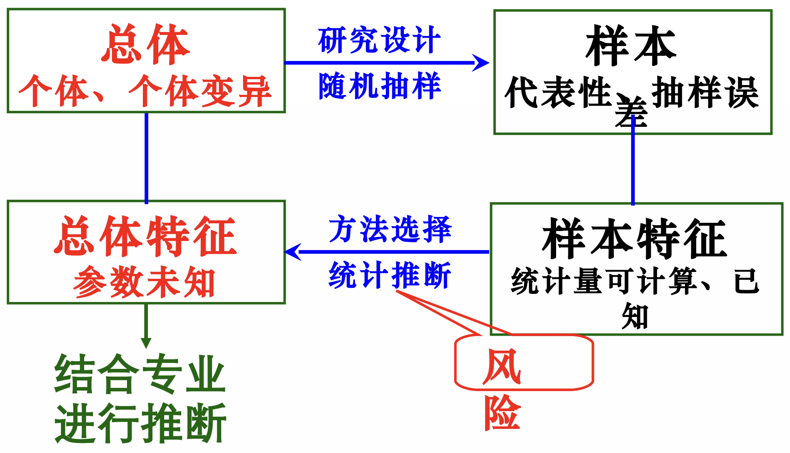
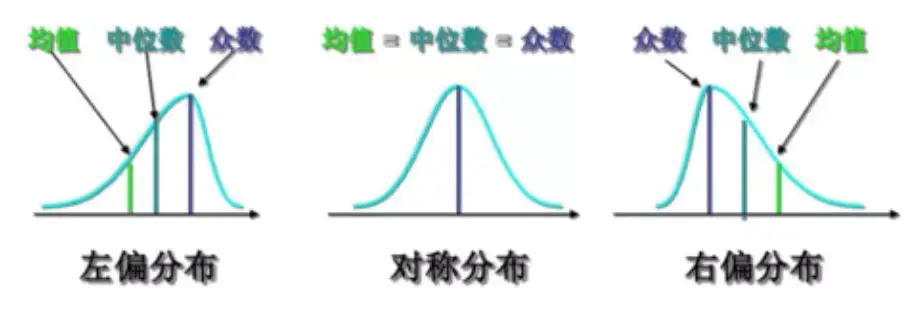
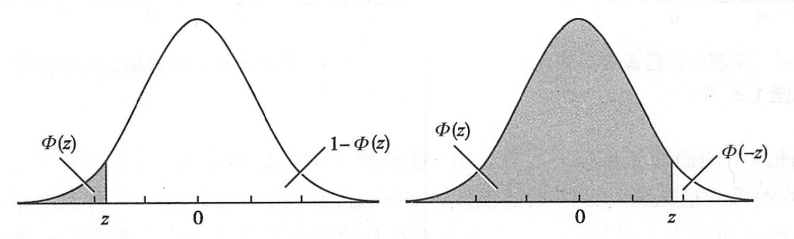
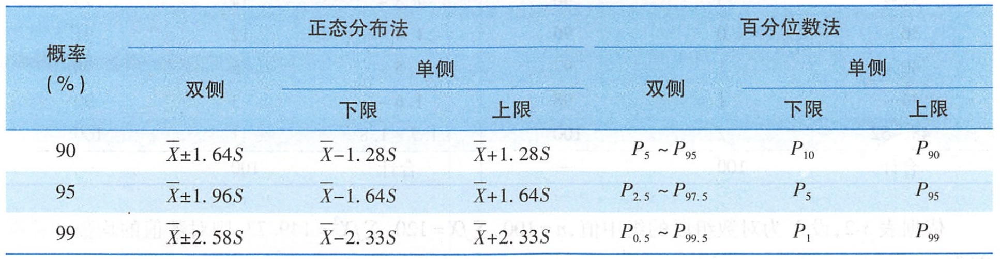

# 医学统计学 Chapter 1-2
## Ch1. 基本概念

- **同质(homogeneity)** 指观察单位或研究个体间具有相同或相近的性质
- **变异 (variation)** 是指同一种测批在总体中不同观察单位或个体之间的差异

**数据类型**
- **定量数据（quantitative data）**：计量资料（measurement data）。数值型数据
  - 连续
  - 离散
- **定性数据（qualitative data）**：计数资料。
  - 两分类资料
  - 多分类资料
- **有序数据（ordinal data）**： 等级资料。

**总体与样本**
- **总体 (population)**：研究对象的全体，它通常由所有的同质观察单位或个体组成
  - 有限总体
  - 无限总体
- **样本（sample）**：从总体中选取的有代表性的一部分观察单位或个体，通常使用**随机选取**方法得到 。

参数与统计量

- **参数（parameter）**：描述总体特征的统计学指标
- **统计量（statistic）**：由样本计算出的特征指标

误差（Error）
- **系统误差 (systematic error)**：由一些固定因素产生，如仪器未进行归零校正、标准试剂校准不好，etc。
  - **特性**：通常恒定或按照一定规律变化，具有明确的方向性。
  - **缓解措施**：周密的研究设计和测量过程标准化等措施加以消除或控制。
- **随机测量误差（random measurement error）**：由于各种偶然因素影响，造成同一测量对象多次测定的结果不完全相同
  - **特性**：种误差往往没有固定的大小和方向，但具有一定的统计规律（如服从正态分布）
  - **缓解措施**：多次测量对真实值进行比较准确的估计。
- **抽样误差（sampling error）**：随机误差中最重要的一种误差。

## Ch2.1 定量数据的统计描述

### 频数 Freq

考虑测量数据 $X \in \mathbb{R}^N$，我们可以将其转化成频数表（frequency table）。

- 计算其极差 (range)
$$
\mathcal{R}_X = \max{X} - \min{X}
$$
- 对数据进行分组
  - 组数：例如将一个 区间为 $[1.0, 10]$, 拆分成9段。9就是组数。
    - 通常取 $k=8 \sim 15$
  - 组距：通常取相同组距，即 $R/k$。
  - 组限：即组的限制，左开右闭。e.g., `3.0~, 4.0~, 4.0~5.0`
- 计数

直方图用处
- 陈述资料
- 观察数据分布
- 发现离群值（outlier）
- 作分段概率估计

### 平均值

**算数均数**

$$
\bar{X} = \frac{\sum_i X_i}{N}
$$

**加权算术均数**

$$
\bar{X} = \frac{\sum_i \lambda_i X_i}{N}
$$

**几何均数（适用于右偏态数据）**
> 右偏态数据假设数据经过 $\lg$ 运算后会近似为正态分布。
$$
\begin{align*}
G &= \sqrt[n]{\prod_i X_i}\\
&= \sqrt[n]{X_1X_2\cdots X_N}\\
\end{align*}
$$

$$
\begin{align*}
G &= \lg^{-1} \frac{\sum_i \lg X_i}{N}\\
&= \lg^{-1} \frac{1}{N}\lg \prod_i X_i \\
&= \lg^{-1} \lg \prod_i X_i^{-n} \\
\end{align*}
$$

### 中位数 $M$ 与 百分位数 $P_x$

**百分位数 $P_x$**：使得 $x\%$ 的数据项 $\leq P_x$，$1-x\%$ 的数据 $\geq P_x$。

**中位数 $M$：**：$M=P_{50}$
- $n= odd$: $M = X_{\left( \frac{n+1}{2} \right)}$
- $n= even$: $M = \frac{1}{2}  \left( X_{\left( \frac{n}{2} \right)} + X_{\left( \frac{n+1}{2} \right)} \right)$
- 正态分布 $M \approx \bar{X}$

**四分位数**: $P_{25}$, $P_{50}$, $P_{75}$, $P_{100}$。

| 指标 | 意义 | 适用范围 |
:-- | :-- | :-- 
算术均数 | 平均数量水平 | 呈正态分布的资料
几何均数 | 对数转换后的平均数量水平 | 呈**等比级数**或**对数正态分布**的资料
中位数   | 位次居中的值 | 常用于偏态分布、分布不明或末端无确切值的资料

### 变异程度

- **极差（Range）**：$R=X_\text{max} - X_\text{min}$
- **四分位数间距**：$Q=P_{75} - P_{25} = Q_3 - Q_1$
- **方差**

样本内：

$$
S^2=\frac{\sum (X-\bar{X})^2}{n-1}
$$

全部数据：

$$
\sigma^2=\frac{\sum (X-\mu)^2}{n}
$$
- **标准差**：$S=\sqrt{S^2}, \sigma = \sqrt{\sigma^2}$
- **变异系数（CV）**：$CV=\frac{S}{\bar{X}\times 100\%}$

| 指标 | 适用范围 | 特点 |
|---|---|---|
| 极差 $R$ | 偏态分布 | 刻画所有观测值的离散程度 |
| 四分位数间距 $Q$ | 偏态分布 | 刻画中位数两侧 50% 观测值的离散程度。 |
| 方差 $\sigma^2, S^2$ | 正态分布 | 刻画所有观测值与均数相距的平均距离。 单位为原始观测值的平方。 |
| 标准差 $\sigma, S$ | 正态分布 | 单位与原始观测值相同。 |
| 变异系数 $CV$ | 单位不同或均数相差悬殊的指标变异程度比较 | 无单位 |

## Ch2.2 正态分布

$$
f(X) = \frac{1}{\sigma \sqrt{2\pi}} \exp{\frac{-(X-\mu)^2}{2\sigma^2}}
$$

- $\mu \pm \sigma$: $\int{\mathcal{N}} = 68.27\%$
- $\mu \pm 1.96\sigma$: $\int{\mathcal{N}} = 95.00\%$
- $\mu \pm 2.58\sigma$: $\int{\mathcal{N}} = 99.00\%$

### U 变换 / Z 变换

> U 变换可以将正态分布转化成标准正态分布（$\mu = 0, \sigma=1$），从而通过正态分布计算对应数值。

$$
u = \frac{X-\bar{X}}{\sigma}
$$

> $\mathcal{N}(0,1)$：标准正态分布  
> $\varphi(x)$：标准正态分布函数，$\varphi(x) = \mathcal{N}(x \mid \mu = 0, \sigma=1)$  
> $\Phi(0,1)$：标准正态分布的累计概率，即标准正态分布左侧面积。

$$
\Phi(u) = p(X \leq u) = \int_{-\infty}^{u} \varphi(x) dx
$$

因此有，对于 $z > 0$:
$$
\Phi(u) = 1 - \Phi(-u)
$$

特殊界值：
- 95% 双侧：$u_{0.05/2} = 1.96$
- 99% 双侧：$u_{0.01/2} = 2.58$

> $P(L < u < H) = \Phi(H) - \Phi(L)$  
> e.g.,
> $$
> \begin{align*}
> &P(-1.96<u<1.96)\\
> =\ & \Phi(1.96) - \Phi(-1.96)\\
> =\ &0.95
> \end{align*}
> $$

> **Q:** 估计白细胞计数在 $6.0 \sim 9.0 \ (10^9/L)$ 之间的正常成年人所占的比例，即求：$P(6.0 < X < 9.0)$  
> 已知指标服从正态分布，均数和标准差为：  
> $\bar{X} = 6.89 \ (10^9/L)$  
> $S = 1.44 \ (10^9/L)$
>
> **A:** $u= \frac{X-\bar{X}}{S} = \frac{X- 6.89}{1.44}$  
> 带入 $X_1 = 6.0, X_2 = 9.0$, 求得 $u_1 = -0.62, u_2 = 1.47$  
> $P(6.0 < X < 9.0) = \Phi(-0.62<u<1.47) = 0.6616$

### 医学参考值范围

特定的 **“正常”人群** 的解剖、生理、生化指标及组织代谢产物含量等数据中，**大多数** 个体的取值所在的范围。

> **并不是指机体任何器官、任何组织的形态和机能都正常的健康人，而是排除了对所研究指标有影响的疾病和有关因素的特定人群。**

**应用前提**
- 研究指标服从正态分布；
- 研究指标不服从正态分布，但经过变量转换后服从正态分布。
  - 变量转换方法：对数转换、三角函数转换等  
    注意：确定界值后需作逆变换恢复原来的数量水平

- 双侧 $1-\alpha$ 参考范围：$\bar{X} \pm u_{\alpha /2} S$
- 单侧 $1-\alpha$ 参考范围：$\bar{X} - u_{\alpha} S$（左值）或$\bar{X} + u_{\alpha} S$（右值）

| 资料特征 | 集中趋势（平均水平） | 离散趋势（变异情况） |
|---|---|---|
| 正态分布 | 均数 | 方差，标准差 |
| 等比级数或对数正态分布 | 几何均数 | 极差，四分位数间距 |
| 其他分布 | 中位数 | 极差，四分位数间距 |

- 不同类型或同类型但均数相差悬殊的资料变异度的比较：**变异系数**。