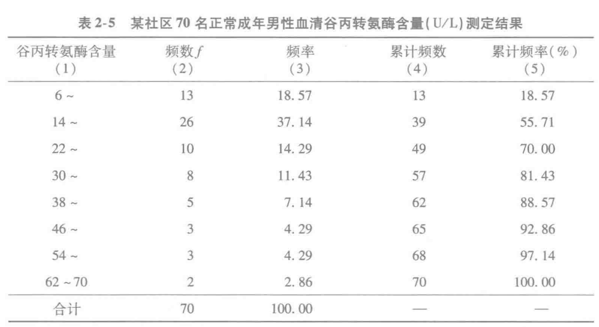
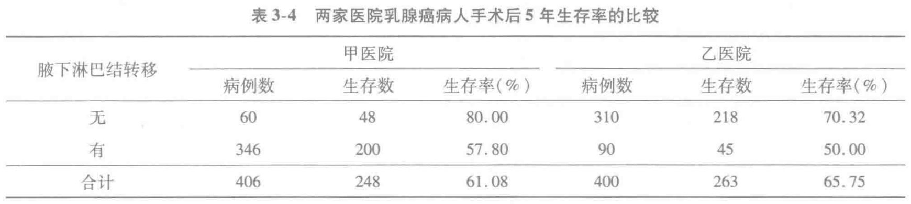
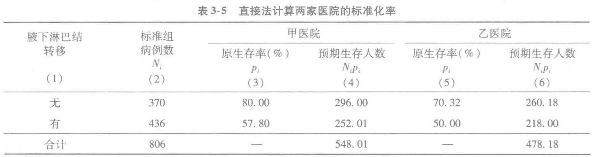
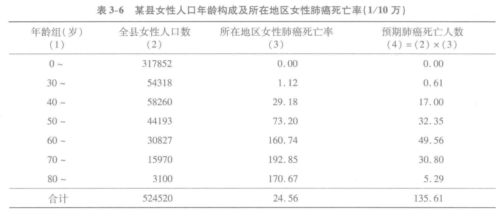

## Bundle for Last Lecture

百分数的计算
$$
P_x = L+\frac{i}{f_i}(n\cdot x\%-\sum f_L)
$$
$L$ 是 $P_x$ 所在组的 Lower Bound. $i$ is 组距 of $P_x$, $f_i$ 是 $P_x$'s group's freq number, $\sum f_L$ is all group < L's sum of freq number. $n$ is sample size.

> We sep above into 2 parts
> $$
> L+i \times \left\{ \frac{n\cdot x\%-\sum f_L}{f_i} \right\}
> $$
> L+i*factor is simple. We care more about how we count over percentage.
>
> $n\times x\%$ calcs $x\%$'s count is how much? (目标累计频数（或排序位置）to $x\%$). Minus the later part we get how many samples over corresponding L.

$$
M=14+\frac{8}{26}(70\times50\% -13)=20.77
$$

### Standarisation

We have 2 kinds of standarisation methods:

1. 直接法：已知被标化组的各层阳性事件率时

   - 已知标准组年龄别人口数时，标准化率 \(p'\) 的计算公式为
     $$
     p'=\frac{\sum N_i p_i}{N}
     $$

   - 已知标准组年龄别人口构成比时，标准化率 \(p'\) 的计算公式为
     $$
     p'=\sum\left(\frac{N_i}{N}\right)p_i
     $$
     

2. 间接法：当待标化组的各层事件阳性数或阳性率未知，只有各层人口数和阳性总例数时，可采用间接标准化。间接标准化必须有标准组的各层事件阳性率，计算公式为:
   $$
   p'=P\cdot \frac{r}{\sum n_i P_i}
   $$
   上式中，\(P\) 为标准组的事件发生总率，\(r\) 为待标化组的实际发生人数，\(\sum n_iP_i\) 是根据标准组的事件发生率推算出的待标化组的预期发生人数，\(\dfrac{r}{\sum n_iP_i}\) 是待标化组的实际发生人数与预期发生人数之比，称为标化比。如果要计算标化死亡率，则 \(\dfrac{r}{\sum n_iP_i}\) 被称为标化死亡比（standardized mortality ratio，SMR）

#### 直接法

甲：$p'(无)=(60+310)\times 80\% = 296$

标化后，甲的5年生存率 $p'=(548.01/806)=67.99\%$

#### 间接法

某县女性人口数524,520人，2013年该县女性因肺癌死亡92人，肺癌死亡率为100000/10万=17.54/10万，而该县所在地区的女性肺癌死亡率为24.56/10万。

问：该县女性肺癌死亡率是否低于该县所在地区的一般女性人群的肺癌死亡率?
$$
p'=P\cdot \frac{r}{\sum n_i P_i}
$$

> \(P\) 为标准组的事件发生总率，\(r\) 为待标化组的实际发生人数，\(\sum n_iP_i\) 是根据标准组的事件发生率推算出的待标化组的预期发生人数，\(\dfrac{r}{\sum n_iP_i}\) 是待标化组的实际发生人数与预期发生人数之比，称为标化比。

$$
SMR=\frac{实际死人}{预期死人}=\frac{92}{135.61}=0.678
$$

$$
p'=p\times SMR=24.56/10e5 \times 0.678 = 16.65/10e5
$$

## 增速

$$
\begin{align*}
\text{定基比发展速度} &=\frac{a_i}{a_0}\\
\text{定基比增长速度} &=\frac{a_i}{a_0}-1\\
\text{环比发展速度} &=\frac{a_i}{a_{i-1}}\\
\text{环比增长速度} &=\frac{a_i}{a_{i-1}}-1\\
\text{平均发展速度} &=\sqrt[n]{\frac{a_n}{a_0}}\\
\text{平均增长速度} &=\sqrt[n]{\frac{a_n}{a_0}}-1 \\
\end{align*}
$$

## 正态分布

$$
X\sim \mathcal{N}(\mu, \sigma^2)\\
\bar{X}= \frac{\sum X}{n}
$$

Consider X bar ~ N, so.
$$
\mathbb{E}(\bar{X}) = \mathbb{E}(\frac{1}{n}\sum X)=\frac{1}{n}\sum^n\mathbb{E}(X_i) =\mu
$$

> $$
> \mathbb{E}(X_i) = \int^\infty_\infty x f_{X_i}(x) dx = \mu
> $$
>
> 

$$
\begin{align*}
Var(\bar{X}) &= Var{(\frac{1}{n}\sum X)}\\
&= \frac{1}{n^2}\sum^n Var(X_i)\\
&= \frac{1}{n^2} \sigma^2
\end{align*}
$$

so that $\bar{X} \sim \mathcal{N}(\mu, n^{-1}{\sigma^2})$, 其中 SE=$n^{-1}\sigma^2$

## T 分布

**Standard Error:** 如果反复抽取同样大小的样本，各次得到的样本均数通常会相差多少
$$
SE=s_{\bar{x}}=\frac{s}{\sqrt{n}}
$$
**T-Distribution**

$x \sim \mathcal{N}(\mu, \sigma)$，样本均数 $\bar{x} \sim \mathcal{N}(\mu, \sigma^2_{\bar{x}})$。对样本均数做 standarisation，可得
$$
z = \frac{\bar{x}-\mu}{\sigma/\sqrt{n}} \sim \mathcal{N}
$$
考虑 $\sigma$ 不可知，因此替换为 $s_{x}$， 可得
$$
t = \frac{\bar{x}-\mu}{s_{{x}}/\sqrt{n}} = \frac{\bar{x}-\mu}{s_{\bar{x}}}
$$

## Bernoulli 分布

$$
P(x=k)=C^k_n \pi^k(1-\pi)^{(1-k)}\\
P(x=k+1)=P(x=k)\times\frac{\pi}{1-\pi}\cdot\frac{n-k}{k+1}
$$

Given $x\sim \mathcal{B}(n, \pi)$
$$
\begin{align*}
\mu_x &= n\pi\\
\sigma_x^2 &= n\pi(1-\pi)
\end{align*}
$$

> $$
> \begin{align*}
> Var(X) &= \mathbb{E}[(X-\mathbb{E}(X))^2]\\
> &= \mathbb{E}[(X-\mu)^2]\\
> &= \mathbb{E}[X^2-2\mu X+\mu^2]\\
> &= \mathbb{E}[X^2]-2\mu\mathbb{E}[X]+\mathbb{E}[\mu^2]\\
> &= \mathbb{E}[X^2]-2\mu\mathbb{E}[X]+\mu^2\\
> &= \mathbb{E}[X^2]-2\mu^2+\mu^2\\
> &= \mathbb{E}[X^2]-\mu^2\\
> Var(X) &= \mathbb{E}[X^2]-[\mathbb{E}(X)]^2
> \end{align*}
> $$
>
> 

> $$
> \begin{align*}
> Var(X) &=\mathbb{E}[X^2]-[\mathbb{E}(X)]^2\\
> &=\mathbb{E}[X]-[\mathbb{E}(X)]^2\\
> &=\pi-[\mathbb{E}(X)]^2\\
> &=\pi-\pi^2\\
> \end{align*}
> $$
>
> 考虑 iid，期望与方差可以 连加，因此有factor $n$

样本率=均数 $p=\frac{K}{n} = \frac{1}{n}\sum^n X_i=\bar{X}$
$$
\begin{align*}
Var(p) &= Var(\frac{1}{n}\sum^n X_i)
\\
&= \frac{1}{n^2}Var(\sum^n X_i)
\\
&= \frac{1}{n^2}\sum^n Var(X_i)
\\
&= \frac{1}{n^2}\sum^n (\pi(1-\pi))
\\
&= \frac{\pi(1-\pi)}{n}
\\
SE &= \sqrt{\frac{\pi(1-\pi)}{n}}
\end{align*}
$$

## Poisson 分布

对于二次分布 $\pi \to 0, n\to \infty$, 有泊松分布：
$$
P(x=k)\frac{e^{-\lambda}\lambda^k}{k!}
$$
其中 $\lambda$ 描述平均发生几次。
$$
P(x=k+1) = \frac{\lambda}{k+1}P(x=k)
$$

$$
\sigma = \mu =\lambda
$$

## CI

$$
P(a \leq T(X; \theta) \leq b) = 1-\alpha
$$

其中 \(T\) 的分布已知，\(a,b\) 是该分布的分位数。然后把不等式反解成关于参数 \(\theta\) 的范围：
$$
P\left(L(X)\leq \theta\leq U(X)\right)=1-\alpha
$$
\([L(X),U(X)]\) 就是置信度为 \(1-\alpha\) 的 CI。

> 若整体 ~ N
> $$
> P\left(-z_{1-\alpha/2}\leq \frac{\bar X - \mu}{\sigma / \sqrt n} \leq 	z_{1-\alpha/2}\right)=1-\alpha
> $$
>
> $$
> \mu \in \left[
> \bar X - z_{1-\alpha/2} \frac{\sigma}{\sqrt n}
> ,
> \bar X + z_{1-\alpha/2} \frac{\sigma}{\sqrt n}
> \right]
> $$
>
> 

> 若整体 ~ N, 服从样本差 $S$，即 $T$ 分布，
> $$
> T=\frac{\bar{X}-\mu}{S / \sqrt{n}}
> $$
>
> $$
> \boxed{ \mu\in \left[ \bar X-t_{n-1,1-\alpha/2}\frac{S}{\sqrt n}, \quad \bar X+t_{n-1,1-\alpha/2}\frac{S}{\sqrt n} \right] }
> $$
