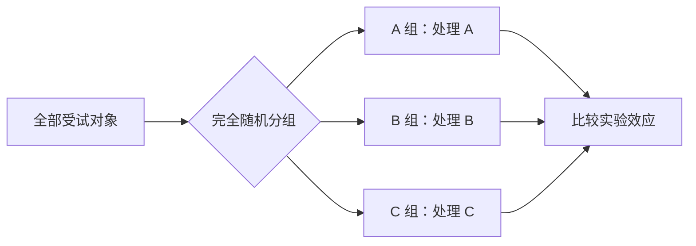
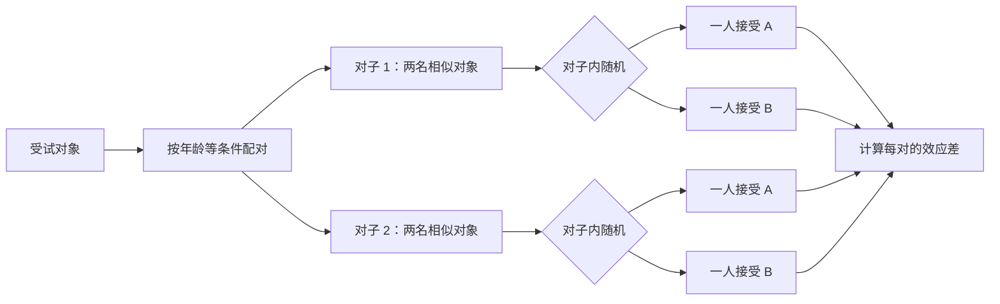
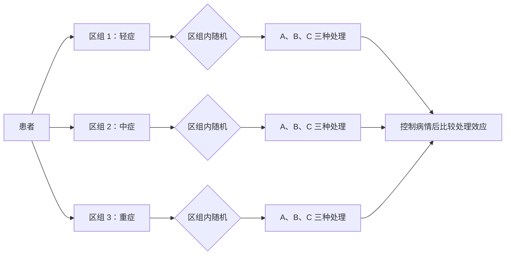
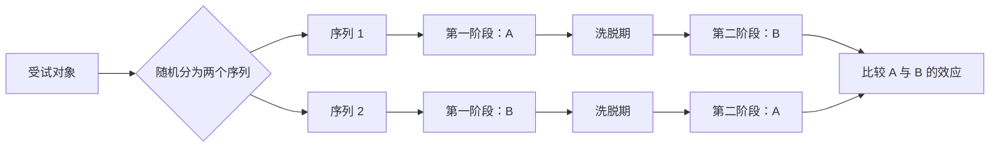
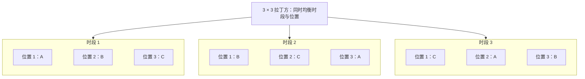
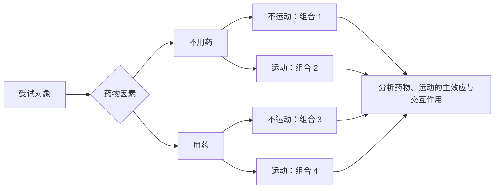
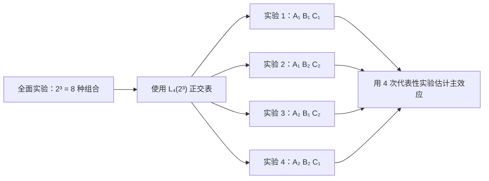

# 医学统计学 Chapter 4

## 实验设计与假设检验的基本思想

## 1. 研究设计的类型

研究设计按是否对受试对象施加干预分为两类：

| 类型 | 是否施加干预 | 能否随机分组 | 通常能说明什么 |
|---|---:|---:|---|
| 实验性研究（experimental study） | 是 | 是 | 因果关系 |
| 观察性研究（observational study） | 否 | 通常不能 | 现状与关联 |

- **实验性研究**：研究者主动施加干预，再观察实验效应。例如把托儿所随机分为手卫生干预组与对照组，比较疾病发生情况。
- **观察性研究**：不施加干预，只按对象已有特征分组并记录。例如比较吸烟者与从不吸烟者的肺癌发生情况。

> 危险因素不能为了实验而强加给受试者。观察性研究中发现的关联通常不能直接解释为因果关系。

## 2. 实验设计的三要素

### 2.1 处理因素（treatment factor）

处理因素是研究者根据研究目的施加给受试对象的因素。

- 同一个处理因素可以有多个**水平（level）**，例如药物剂量 10 mg、20 mg。
- 一个处理因素称为单因素实验；同时研究多个处理因素称为多因素实验。
- 处理因素应当标准化，例如固定药物厂家、批号和剂量。

**非处理因素（non-treatment factor）/混杂因素（confounding factor）**也会影响实验效应，但不是研究目的。例如研究降脂药时，饮食也可能影响血脂。

实验设计需要尽量控制混杂因素，使观察到的效应能够归因于处理因素。

### 2.2 受试对象（subject）

受试对象可以是病人、正常人、志愿者、实验材料或动物等。

选择受试对象时应注意：

- 对处理因素敏感，能够产生可观察的反应；
- 个体反应相对稳定，避免过大的个体差异；
- 病人应有明确的诊断、纳入和排除标准；
- 涉及人体研究时应知情同意并保证安全；
- 志愿者的选择可能产生选择偏倚（selection bias）。

**脱落（dropout）**：受试者在研究结束前因死亡、搬迁、失联等原因退出，使数据不完整。

### 2.3 实验效应（experimental effect）

实验效应是处理因素作用于受试对象后产生的研究结果。

效应指标应尽量满足：

- 客观；
- 可量化；
- 灵敏；
- 特异。

例如评价水的颜色时，测量吸光度比依靠肉眼判断更加客观。

## 3. 实验设计的三原则

Fisher 提出的三个基本原则是：**对照、随机化、重复**。

### 3.1 对照（control）

设置对照的主要目的是排除混杂因素的影响。

| 对照类型 | 含义 |
|---|---|
| 空白对照 | 不施加任何干预 |
| 实验对照 | 不施加所研究的处理因素，但施加相关实验因素 |
| 标准对照 | 使用现有标准方法、常规方法或金标准 |
| 自身对照 | 同一个体处理前后比较 |
| 相互对照 | 不另设对照组，各实验组互为对照 |
| 文献对照 | 与既往研究或历史数据比较 |

### 3.2 随机化（randomization）

随机化是均衡非处理因素的重要方法，包括：

1. **随机抽样**：提高样本对总体的代表性；
2. **随机分组**：使每个个体有同等机会进入各处理组；
3. **随机实验顺序**：均衡实验先后次序造成的影响。

### 3.3 重复（replication）

重复可以表现为：

1. 重复整个实验，降低偶然结果的影响；
2. 对多个受试对象实施相同实验，避免把个体现象当成普遍现象；
3. 对同一对象多次测量，提高测量的精密度。

## 4. 常用实验设计

理解各种设计的一条主要线索是：**它能够均衡或控制哪些混杂因素**。

### 4.1 完全随机设计（completely randomized design）

把全部受试对象完全随机地分到两个或多个处理组。

- 一般是单因素设计；
- 各组样本量可以相等，也可以不等；
- 优点：简单，容易实施；
- 缺点：没有主动控制特定混杂因素，个体差异较大时检验效能较低。

### 4.2 配对设计（paired design）

先把条件相近的两个个体配成对子，再在每个对子内随机分配两种处理。

- 可以均衡 **1 个主要混杂因素**，例如年龄；
- 配对后个体差异减小，检验效能通常较高；
- 若一名对象的数据缺失，整对数据可能无法使用。

同一个体接受两种处理，或同一份标本用两种方法测量，也可以构成配对资料。

### 4.3 随机区组设计（randomized block design）

把条件相近的多个个体组成一个区组，再在区组内随机分配不同处理。

- 区组因素是需要控制的混杂因素，例如病情轻、中、重；
- 可以均衡 **1 个主要混杂因素**；
- 区组内通常包含全部处理水平；
- 区组内任一数据缺失会破坏完整性。

> 配对设计可以看作每个区组中只有 2 个对象、对应 2 种处理的随机区组设计。

### 4.4 交叉设计（crossover design）

同一受试者在不同时期依次接受不同处理。例如：

- 第一组：A → 洗脱期 → B；
- 第二组：B → 洗脱期 → A。

**洗脱期（washout period）**用于消除前一种处理的残余效应。

- 每个人都接受各种处理，可以控制个体差异；
- 调换处理次序，可以均衡时间和次序效应；
- 所需样本量较小，检验效能较高；
- 实验周期长，较容易发生受试者脱落；
- 不适用于处理效果不可逆或疾病状态变化很快的情况。

### 4.5 拉丁方设计（Latin square design）

用行和列分别表示两个混杂因素，用格子中的符号表示处理水平。要求每一种处理在每行、每列中都恰好出现一次。

- 可以同时均衡 **2 个混杂因素**；
- 若有 $p$ 个处理水平，需要进行 $p^2$ 次实验；
- 要求处理水平数 = 行数 = 列数；
- 通常要求行因素与列因素之间不存在交互作用；
- 数据缺失容易破坏整体均衡。

### 4.6 析因设计（factorial design）

把两个或多个处理因素的所有水平进行**全面组合**。

例如药物有 2 个水平，运动有 2 个水平，则

$$
2\times 2=4
$$

种处理组合。

- 可以分析各因素的**主效应（main effect）**；
- 可以分析因素之间的**交互作用（interaction）**；
- 因素数或水平数增加时，组合数会迅速增长。

**交互作用**：一个因素的效应随另一个因素的水平而改变，即联合效应不能用各因素效应的简单相加解释。

### 4.7 正交设计（orthogonal design）

正交设计利用正交表，从析因设计的全部组合中选取一部分有代表性的组合。

正交表记作：

$$
L_n(p^k)
$$

其中：

- $n$：实验次数；
- $p$：因素的水平数；
- $k$：最多可以安排的因素数。

例如 $2^7$ 析因设计需要 $128$ 次实验，而 $L_8(2^7)$ 只需要选择 8 次代表性实验。

- 优点：显著减少实验次数和样本量；
- 各因素的不同水平能够均衡出现；
- 主要用于分析主效应；
- 与全面析因设计相比，通常会牺牲交互作用信息。

> 正交设计、拉丁方设计与拉丁超立方采样不是同一概念。正交表强调离散因素组合的均衡；拉丁超立方采样主要保证连续空间中每个维度的一维分层均匀。

### 4.8 重复测量设计（repeated measures design）

对同一受试对象在多个时间点或多个条件下重复测量。例如测量运动后 1、5、10 分钟的心率。

- 优点：利用自身对照，节省样本并降低个体差异；
- 缺点：同一对象的多次观测彼此相关，数据不独立，需要专门的统计方法。

重复测量中的因素包括：

- **受试者内因素（within-subject factor）**：同一对象内部变化的因素，例如时间；
- **受试者间因素（between-subject factor）**：不同对象或组之间的因素，例如不同药物组。

### 4.9 各设计的比较

| 设计 | 主要控制或均衡的因素 | 是否适合分析交互作用 |
|---|---|---:|
| 完全随机设计 | 无指定混杂因素 | 否 |
| 配对设计 | 1 个配对因素 | 否 |
| 随机区组设计 | 1 个区组因素 | 否 |
| 交叉设计 | 个体差异和时间次序 | 通常否 |
| 拉丁方设计 | 2 个因素（行、列） | 通常否 |
| 析因设计 | 全部因素水平组合 | 是 |
| 正交设计 | 有代表性的组合 | 主要分析主效应 |
| 重复测量设计 | 同一对象的个体差异 | 视模型而定 |

### 4.10 Mermaid 示例

下面用流程图表示不同实验设计中受试对象、处理因素和混杂因素的安排方式。

#### 1）完全随机设计

把所有受试对象直接随机分到不同处理组，不预先按其他因素配对或分层。

#### 2）配对设计

先按年龄、性别或病情等条件组成相似的对子，再在每个对子内部随机分配两种处理。

#### 3）随机区组设计

先按一个重要混杂因素组成区组，再在每个区组内随机安排全部处理。

#### 4）交叉设计

每名受试者先后接受两种处理，并利用相反的处理次序平衡时间效应。

#### 5）拉丁方设计

下例有三种处理 A、B、C。行表示时段，列表示位置；每种处理在每行、每列中都出现一次。

对应的处理排列为：

| 时段／位置 | 位置 1 | 位置 2 | 位置 3 |
|---|---:|---:|---:|
| 时段 1 | A | B | C |
| 时段 2 | B | C | A |
| 时段 3 | C | A | B |

#### 6）析因设计

药物和运动各有两个水平，对所有水平组合都进行实验。

这是一个 $2\times2$ 析因设计，共有 4 种组合：

| 组合 | 药物 | 运动 |
|---|---|---|
| 1 | 不用药 | 不运动 |
| 2 | 不用药 | 运动 |
| 3 | 用药 | 不运动 |
| 4 | 用药 | 运动 |

#### 7）正交设计

正交设计不实验全部组合，而是用正交表选取均衡、有代表性的组合。以下是三个两水平因素的 $L_4(2^3)$ 示例。

#### 8）重复测量设计

同一对象在多个时间点重复测量，因此不同时间点的数据彼此相关。

## 5. 假设检验的基本思想

### 5.1 零假设与备择假设

假设一般健康成年男子的脉搏总体均数为 $\mu_0=72$ 次/分。现从某山区抽取 $n=25$ 人，得到 $\bar{x}=74.2$。

样本均数与已知总体均数不同，可能有两个原因：

1. 两个总体相同，差异只是抽样误差；
2. 两个总体确实不同。

**零假设（null hypothesis）**通常表示总体之间无差异：

$$
H_0:\mu=\mu_0
$$

**备择假设（alternative hypothesis）**表示总体之间存在差异，可以写成：

$$
H_1:\mu\ne\mu_0
$$

或根据研究目的写成有方向的形式：

$$
H_1:\mu>\mu_0
\qquad\text{或}\qquad
H_1:\mu<\mu_0
$$

### 5.2 两个基本原理

1. **反证法**：先假定 $H_0$ 成立，再判断样本是否与这一假定严重矛盾。
2. **小概率事件原理**：在一次随机试验中，小概率事件通常不会发生。如果 $H_0$ 成立时当前样本出现的概率很小，则怀疑并拒绝 $H_0$。

判定小概率事件的标准称为**检验水准（significance level）**，记作 $\alpha$，常取：

$$
\alpha=0.05 \quad\text{或}\quad 0.01
$$

### 5.3 为什么从 $H_0$ 出发

$H_0$ 通常给出一个明确条件，例如“两个总体均数相等”，因此可以在其成立的前提下推出统计量的抽样分布。

$H_1$ 往往包含许多可能情况，不能直接据此推导唯一的抽样分布。因此假设检验先假定 $H_0$ 成立，再计算当前样本出现的概率。

> 当证据不足时，只能说“**不拒绝 $H_0$**”，不能说“接受 $H_0$”。不拒绝可能表示确实没有差异，也可能是样本量太小、检验效能不足。

## 6. 假设检验的步骤

1. 建立 $H_0$ 和 $H_1$，确定检验水准 $\alpha$；
2. 选择并计算检验统计量；
3. 确定 $P$ 值，与 $\alpha$ 比较，作出统计推断。

## 7. 单样本 $t$ 检验

当总体标准差 $\sigma$ 未知、总体近似正态时，用样本标准差 $S$ 代替 $\sigma$：

$$
T=\frac{\bar X-\mu_0}{S/\sqrt n}\sim t_{n-1}
$$

其中：

- 分子 $\bar X-\mu_0$ 是观察到的差异；
- 分母 $S/\sqrt n$ 是样本均数的标准误；
- 自由度 $\nu=n-1$。

所以 $t$ 统计量表示：

$$
t=\frac{\text{观察到的差异}}{\text{抽样误差}}
$$

$|t|$ 越大，说明观察到的差异越难用抽样误差解释。

### 单样本 $t$ 检验示例

已知：

$$
\mu_0=72,\qquad \bar x=74.2,\qquad n=25
$$

研究问题是山区男子的平均脉搏是否**高于** 72，因此采用单侧检验：

$$
H_0:\mu=72
$$

$$
H_1:\mu>72
$$

取 $\alpha=0.05$。计算得到：

$$
t=\frac{74.2-72}{S/\sqrt{25}}=1.692,
\qquad \nu=25-1=24
$$

查表得单侧临界值：

$$
t_{0.05,24}=1.711
$$

因为

$$
t_{\text{计算}}=1.692<1.711=t_{0.05,24}
$$

所以 $P>0.05$，按 $\alpha=0.05$ 水准不拒绝 $H_0$。现有证据不足以认为该山区成年男子的平均脉搏高于一般人群。

> 双侧检验比较的是 $|t|$ 与双侧临界值；单双侧必须由研究目的事先决定，不能看完数据后再选择。

## 8. $P$ 值

**$P$ 值**是在 $H_0$ 成立的前提下，得到当前样本结果以及更极端结果的概率。

单侧检验中可以写为：

$$
P=P(T\ge t_{\text{计算}}\mid H_0)
$$

双侧检验中，两端同样极端的区域都要计入：

$$
P=P(T\ge |t_{\text{计算}}|\mid H_0)
+P(T\le -|t_{\text{计算}}|\mid H_0)
$$

决策规则：

| 结果 | 统计推断 |
|---|---|
| $P\le\alpha$ | 拒绝 $H_0$，差异有统计学意义 |
| $P>\alpha$ | 不拒绝 $H_0$，差异无统计学意义 |

需要注意：

- $P$ 值是尾部区域的概率，不是某一个点的概率；
- $P$ 值不是“$H_0$ 为真的概率”；
- $P$ 值不表示效应或差异的大小；
- “有统计学意义”不等于“有实际或临床意义”；
- $P>\alpha$ 不表示已经证明没有差异。

## 9. 样本量对 $P$ 值的影响

由

$$
t=\frac{\bar x-\mu_0}{S/\sqrt n}
$$

可知，在 $\bar x-\mu_0$ 和 $S$ 不变时：

- $n$ 增大，标准误 $S/\sqrt n$ 减小；
- $|t|$ 增大；
- 尾部面积减小，即 $P$ 值减小。

因此：

- 大样本可能使很小的差异也具有统计学意义；
- 小样本可能因检验效能不足而无法发现实际存在的差异；
- 报告 $P$ 值时，还应结合效应量和置信区间解释结果。

## 总结

- 实验设计的三要素：处理因素、受试对象、实验效应；
- 实验设计的三原则：对照、随机化、重复；
- 不同设计的核心区别是控制混杂因素的方式以及能否分析交互作用；
- 假设检验以反证法和小概率事件原理为基础；
- 单样本 $t$ 统计量比较观察差异与抽样误差；
- $P$ 值衡量反对 $H_0$ 的证据强弱，不表示差异大小，也不是 $H_0$ 为真的概率。
