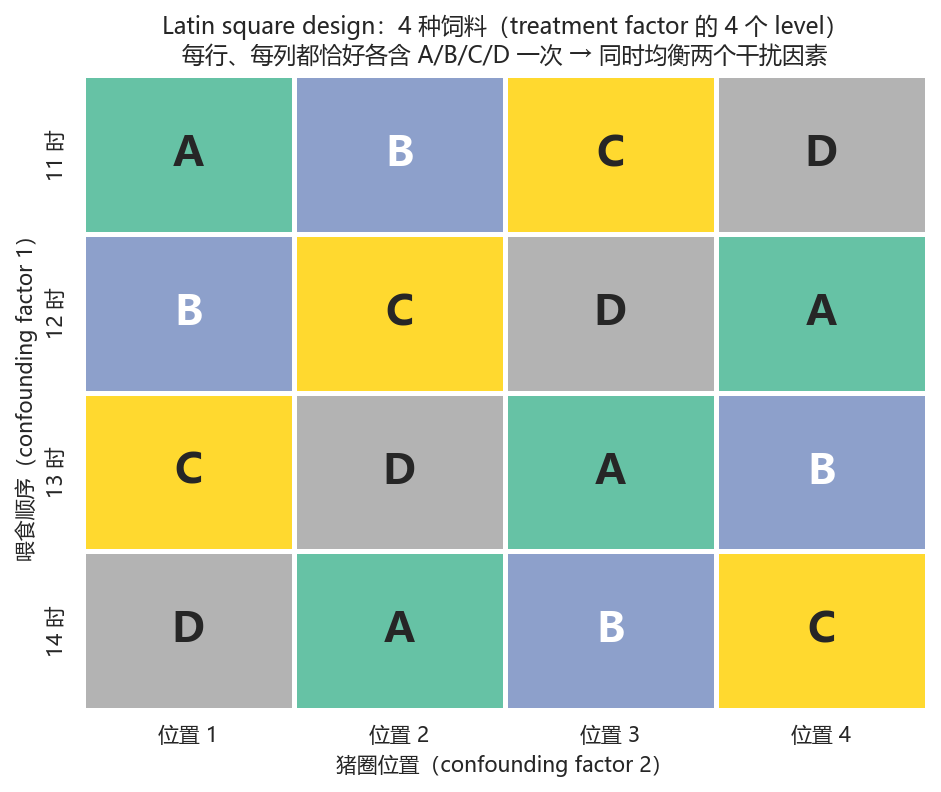
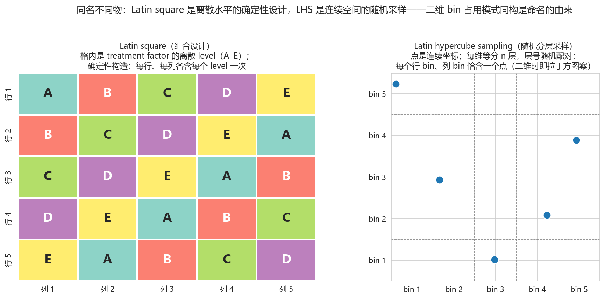
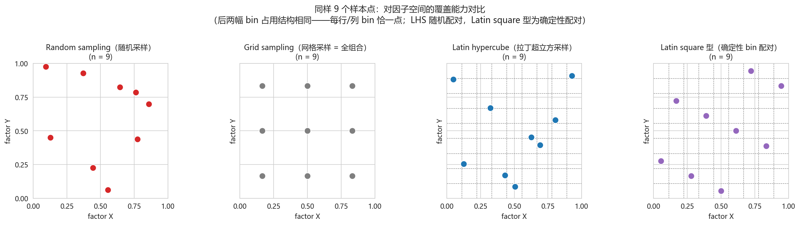
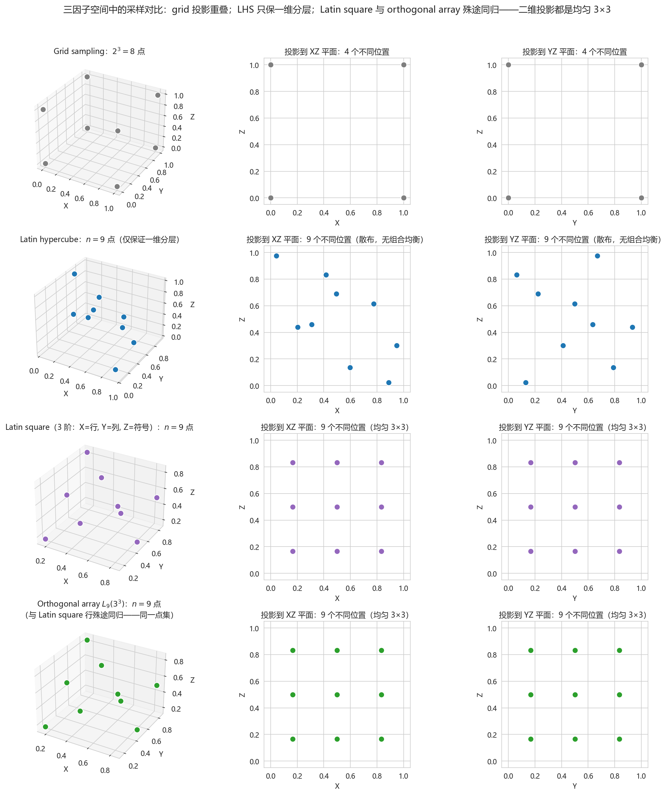
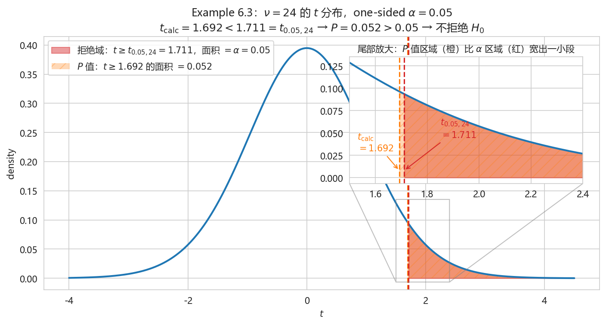

# Lecture 4 — 实验设计（Experimental Design）与假设检验的基本思想

*医学统计学，教材第六章（实验设计）及假设检验引论。依据 2026 年 8 月 2 日课堂逐字稿整理（主讲：JG）。*

**Learning outcomes.** 学完本讲，你应当能够：

- 区分 experimental 与 observational 研究设计，并说明为何只有前者能支持因果结论；
- 陈述实验设计的三要素（treatment factor / subject / experimental effect）与三原则（control / randomization / replication）；
- 按"能均衡掉几个 confounding factor"这一统一线索，比较八种常用实验设计的结构、优缺点与适用场景；
- 陈述 hypothesis testing 的两个原理（反证法、小概率事件原理），说明为何以 $H_0$ 为论点；
- 完成一次单样本 $t$ test 的完整流程（建立假设 → 计算统计量 → 确定 $P$ 值 → 作出推断）；
- 准确解释 $P$-value 的三层含义，并推导 sample size 对 $P$ 值的影响。

---

## 1 从研究问题到研究设计

统计学应用于实际问题时遵循固定流程：先有研究目的，据此提出研究方案（设计），按方案执行并收集数据（样本），再用样本信息做统计分析，最后检验结论与研究目的是否一致。本章解决其中的"设计"环节。研究设计按**是否施加干预措施**分为两类。

**Definition 1.1（experimental study design）.** *Experimental study design*（实验性研究设计）指研究者对受试对象**施加干预措施**（intervention），再观察实验效应的设计。其两个标志性特征是：(i) 施加了干预；(ii) 可以进行**随机分组**。由于干预与分组都在研究者控制之下，此类设计可以支持**因果**结论。

**Definition 1.2（observational study design）.** *Observational study design*（观察性研究设计）指**不施加任何干预**，仅按研究对象的某种既有特征进行客观分组、客观记录的设计。分组由对象的实际特征决定，通常不能随机分组。此类设计只能说明现状与**联系**（association），不能说明因果。

**Example 1.3（两个对照的例子）.**

1. *手卫生与疾病预防（experimental）*：总体为 71 家托儿所，随机分为实验组（36 家，施加干预——培训使用洗手液、香皂、消毒液）与对照组（35 家，不施加任何干预，仅常规教育），比较两组的疾病发生情况。干预与随机分组齐备，是典型的 experimental design。
2. *吸烟与肺癌（必须是 observational）*：若按 experimental design，须随机指定一组人吸烟、一组人不吸烟——把危险因素强加于受试对象违背伦理，不可行。可行做法是：在群体中把吸烟者与从不吸烟者分别找出、按这一既有特征分组，再随访观察两组肺癌发生情况。全程无干预、无随机分组，是 observational design。

**Remark 1.4（因果与联系的分界线）.** 能否支持因果结论，取决于干预与随机分组是否由研究者掌控，而非样本大小或测量精度。这是流行病学方法论的基石。

---

## 2 实验设计的三要素

**Definition 2.1（三要素）.** 实验研究是"研究者根据研究目的，人为地对**受试对象**施加某种**干预措施**，观察**实验效应**"的研究。这句话本身就包含三个基本要素：

1. *treatment factor*（处理因素）：根据研究目的确定的、施加于受试对象的因素（生物、化学、物理因素皆可）；
2. *subject*（受试对象）：处理因素所作用的客体；
3. *experimental effect*（实验效应）：处理因素作用于受试对象后产生的研究结果。

### 2.1 Treatment factor

**Definition 2.2（level）.** *Level*（水平）指同一 treatment factor 在实验中所处的不同状态或等级。例如研究某降脂药（一个 treatment factor）时，$10\,\text{mg}$ 组与 $20\,\text{mg}$ 组即为该因素的两个 level。按 treatment factor 的个数，实验分为单因素实验与多因素实验（如同时研究降脂药与年龄对血脂的影响，即为两因素）。

**Definition 2.3（non-treatment / confounding factor）.** *Non-treatment factor*（非处理因素），又称 *confounding factor*（混杂因素），指与 treatment factor 同时存在、也能使受试对象产生效应、但并非研究目的的其他因素。例如研究降脂药疗效时，患者的饮食同时影响血脂，却并非研究目的。

由此得出设计上的两条要求：

1. **区分并控制 confounding factor**，使其不影响研究结果，从而减小误差；
2. **Treatment factor 标准化**——固定厂家、批号、剂量。这实质上是"控制变量"：只有其他条件都不变，观察到的效应才能归因于该因素本身。

### 2.2 Subject

受试对象的常见类型与要求：

- **病人**：须有明确的诊断标准、纳入标准与排除标准；
- **正常人**：多用于疫苗实验，须知情同意并保证安全；
- **志愿者**：须注意可能引入 *bias*（偏倚）。

按受试对象不同，实验分为四类：实验室实验（血液、尿液等标本）、临床试验（患者或志愿者，多为新药疗效）、社区实验（社区正常人群，群体性）、现场实验（学校、工厂等现场的未患病个体，如亚健康筛查、流感疫苗研究）。

选择受试对象的两条要求：(i) 对 treatment factor **敏感、有反应**——否则投入再大也观察不到效应；(ii) 反应**稳定**——个体间差异须小（如病情、年龄相仿），否则个体差异会污染结果。

**Definition 2.4（dropout）.** 实验往往具有周期性、需要随访。*Dropout*（受试者脱落）指受试者在实验过程中因故（死亡、搬迁、失联）未能按计划观察至终点，导致数据不完整的情形。

### 2.3 Experimental effect

效应指标须满足**客观性**：尽量选用客观、可量化的指标，而非主观指标。例如研究水的色泽，以人眼评判因人而异（主观）；改测*吸光度*则客观、准确。指标另有灵敏性、特异性等要求，属临床试验范畴，此处从略。

**Remark 2.5（三要素的共同目的）.** 对三要素提出上述全部要求，核心目的只有一个：**控制误差、避免 confounding factor 干扰、提高研究结果的准确性与效率**。这一目的将在 §3 的三原则与 §4 的各种设计中反复出现。

---

## 3 实验设计的三原则

Fisher 提出实验设计的三原则：**control（对照）、randomization（随机化）、replication（重复）**。

### 3.1 Control

设置对照的核心目的是排除 confounding factor 的干扰。常用的对照类型：

| 类型 | 做法 | 例子 |
|---|---|---|
| 空白对照（blank control） | 不施加任何干预 | 托儿所例中对照组仅常规教育 |
| 实验对照（experimental control） | 不施加处理因素，但施加与之相关的某种实验因素 | 研究中药空气灭菌：实验组用中药烟熏剂，对照组用不加中药的单纯烟熏 |
| 标准对照（standard control） | 以现有标准/常规方法（金标准）为对照 | 新降脂药 vs 临床已证实有效的标准药物 |
| 自身对照（self control） | 同一个体处理前后比较 | 测量服降压药前后的血压 |
| 相互对照（mutual control） | 不设专门对照组，各实验组互为对照 | 降脂药 10/20/30 mg 各剂量组间比较 |
| 文献对照（historical control） | 与既往研究结果比较 | 将本研究结果与历史数据对照 |

### 3.2 Randomization

Randomization 是**均衡 non-treatment factor 最好的方法**，分三种：

1. **随机抽样**：使样本信息能代表总体（见 Lecture 3）；
2. **随机分组**：使每个个体有同等机会被分配到各处理组，保证组间均衡性；
3. **随机实验顺序**：当实验先后次序可能影响结果时，使每个个体接受各次序的机会均等。

### 3.3 Replication

Replication（重复）分三种：

1. **对整个实验重复**：避免结果出于偶然，提高可靠性；
2. **对多个受试对象重复**：避免把个体状况误认为普遍状况；
3. **对同一受试对象多次测量**：如服药后 1、5、10 分钟各测一次血压，提高结果的精密度（precision）。

---

## 4 常用实验设计方法

以下八种设计可按一条统一线索组织：**各自能均衡掉几个 confounding factor**。完全随机设计均衡 0 个；配对与随机区组设计各均衡 1 个；交叉设计均衡个体差异与时间次序；拉丁方设计均衡 2 个；析因与正交设计面向多因素及交互作用；重复测量设计针对同一对象。

### 4.1 Completely randomized design（完全随机设计）

**Definition 4.1.** 将全部受试对象**随机分组**（两组或多组）的设计。如 14 只大鼠随机分为实验组、对照组各 7 只；也可分为 3 组（如 4、4、6 只），各组例数可以不等。

- 性质：是**单因素设计**——只考察一个 treatment factor。
- 优点：简单，仅需随机分组。
- 缺点：未考虑其他因素的影响，检验效能（*power*，可暂理解为研究结果的准确性）不高；且由于个体变异，随机分组后组间仍可能不均衡。

### 4.2 Paired design（配对设计）

**Definition 4.2.** 把条件相似的个体配成**对子**（pair），每对内随机分配不同处理的设计。如比较新药 A 与旧药 B 的降压效果（同一 treatment factor 的两个 level），而年龄（confounding factor）也影响降压：将 16 名患者按年龄段（15–30、30–45、45–60 岁）配成 8 个对子，每对内两人年龄相近，随机一人用 A 药、一人用 B 药。同一年龄段内比较两种药，年龄的影响即被均衡掉。

- 性质：最大特点是**均衡掉 1 个 confounding factor**（此处为年龄）。可研究单因素（每个对子内两药的效应）或双因素（兼看各年龄段间的差异——但配对条件只能给出大致印象，不能作为正式分析目的）。
- 优点：检验效能高（已均衡一个干扰因素）。
- 缺点：对子中任一对象数据缺失，整个对子作废（只剩一人无法比较 A、B）。

### 4.3 Randomized block design（随机区组设计，又称配伍组设计）

**Definition 4.3.** 把条件相似的**多个**个体组成一个**区组**（block），区组内随机分配各种处理的设计。如比较 A、B、C、D 四种疗法（同一 treatment factor 的四个 level），12 名患者按病情（轻、中、重）分为 3 个区组，每区组 4 人随机接受四种疗法。病情称为*区组因素*；在病情相同的区组内比较四种疗法，病情的影响即被均衡。

**Remark 4.4（paired 与 block 的分界）.** 二者的构造思想完全相同，区别仅在组内例数：组内 **2** 人、对应 2 种处理水平者为配对设计（"对子"即二之意）；组内 **≥3** 人、对应多种处理水平者为随机区组设计。优缺点亦相同：均衡 1 个 confounding factor 故检验效能高；区组内任一数据缺失，该区组作废。

### 4.4 Crossover design（交叉设计）

**Definition 4.5.** 受试对象按事先设计好的**实验次序**，在不同时期分别接受不同处理，再比较处理间效应差异的设计。比较 A、B 两药时：第一组先 A 药 → *washout period*（洗脱期）→ 后 B 药；第二组先 B 药 → 洗脱期 → 后 A 药。洗脱期是让前一药物的余效完全消退、不致污染后一阶段的间隔期。

- 特点：是惟一包含 washout period 的设计；可均衡**个体**（每人都接受了 A 与 B）与**时间次序**（两药都出现在每个阶段）两类影响。
- 优点：所需样本量小，检验效能高。
- 缺点：实验周期长，受试者中途退出（dropout，Definition 2.4）导致数据缺失的风险大。

### 4.5 Latin square design（拉丁方设计）

拉丁方设计是随机区组设计的扩展：后者均衡 1 个 confounding factor，前者可均衡 **2** 个。为此先需要一个概念：

**Definition 4.6（interaction）.** 两个因素共同作用时，其联合效应不等于各自效应简单相加的情形，称存在 *interaction*（交互作用）。例如猪圈位置使猪增重 1 kg、喂食时段也使其增重 1 kg，二者共同作用却增重 10 kg（或 −10 kg）——存在相乘或拮抗关系，即交互作用。

**Definition 4.7.** *Latin square design* 用一张 Latin square 表安排实验：以两个 confounding factor 分别作为行与列，要求**每行、每列都各含全部处理水平且各出现一次**。如研究 4 种饲料（一个 treatment factor，4 个 level）对猪增重的影响，两个 confounding factor 为猪圈位置（列：1–4 号位）与喂食顺序（行：11–14 时）：每行 4 个时段内 4 种饲料齐备（均衡时间），每列 4 个位置内 4 种饲料齐备（均衡位置），每个处理恰好出现 4 次，达到均衡。

- 实验次数：若处理水平数为 $p$，则行数 = 列数 = $p$，共 $p^2$ 次实验（本例 $4^2 = 16$）。

- 优点：高效（$p^2$ 次实验同时控制两个干扰因素），误差小。
- 缺点：(i) 要求行、列两因素**无 interaction**（Definition 4.6），否则结果出错（反过来可借拉丁方检验交互作用，但功效有限）；(ii) 必须满足处理水平数 = 行数 = 列数，水平数不齐时无法使用标准 Latin square；(iii) 任一格子数据缺失即破坏"每处理出现次数相等"的均衡，影响整个分析。

### 4.6 Factorial design（析因设计）

**Definition 4.8.** 将两个或多个 treatment factor 的各 level 做**全部组合**，对每种组合都做实验的设计。它既能分析各因素不同 level 间的差异，也能检验因素间的 *interaction*（Definition 4.6）——这是它区别于前述设计的核心能力。

*记号与实验次数*：有几个因素就有几个数相乘，每个数是该因素的 level 数。如药物（用药/不用药）× 运动（运动/不运动）记为 $2 \times 2$，共 4 种组合；$2 \times 2 \times 3$ 表示三个因素（level 数分别为 2、2、3），共 12 组实验。

- 优点：可分析 interaction（如肥料与水量对植物生长的加成效应）。
- 缺点：组合数随因素数与 level 数**爆炸式增长**（$3^3 = 27$ 组），样本量需求激增。

### 4.7 Orthogonal design（正交设计）

**Definition 4.9.** 针对 factorial design 组合数爆炸的问题，orthogonal design 根据**正交性**，从全面实验中挑选部分**有代表性的组合**进行实验。挑选借助*正交表*完成，其记号为

$$
L_{n}(p^{k}),
$$

其中 $L$ 为正交表记号，$n$ = 实验次数，$p$ = 各因素的 level 数，$k$ = 最多可安排的因素数。例如 $2^7$ 的 factorial design 需 $128$ 次实验，用正交表 $L_8(2^7)$ 只挑 **8** 次代表性实验。

代表性由正交表的构造保证：**每一列中各 level 出现的次数相等**。因此研究某一列（某因素）的效应时，其余各因素的各 level 在该列两水平下出现次数相同，其影响被均衡掉。因素可依研究目的合并或忽略，此时分析的是*主效应*（*main effect*）。混合水平的正交表亦存在，如 $L_{16}(4^2 \times 2^9)$：2 个四水平因素与 9 个两水平因素，共 16 次实验。

- 优点：高效，大幅节省样本量。
- 缺点：只能分析 main effect，牺牲了 interaction 信息。

**Remark 4.12（从采样视角看 orthogonal design）.** 把每个 treatment factor 视为一个坐标轴，一次实验就是因子空间中的一个点，则"设计"等价于**采样方案的选择**。三因子情形下：random sampling 的投影杂乱无章；grid sampling（= factorial design 的全组合，$2^3 = 8$ 点）在任一坐标平面上的投影大量重叠——8 个点只占 4 个不同位置。另有两条改进路线，**不可混为一谈**：

- *Latin hypercube sampling*（LHS，拉丁超立方采样）：把每个坐标轴等分为 $n$ 个层，每层恰取一个样本。它只保证**一维边缘投影**分层均匀，对二维以上投影不提供任何组合均衡——9 个点在 XZ、YZ 平面上只是 9 个散布点。
- *Orthogonal sampling*（正交采样，基于 *orthogonal array* 正交表）：是一种组合构造。strength 为 2 时，任意两列的水平组合出现次数**相等**——$L_9(3^3)$ 的 9 个点在**每个**二维投影上恰为均匀的 $3 \times 3$ 网格。正交设计所用的正交表 $L_n(p^k)$ 正是 orthogonal array；Definition 4.9 中"每列各 level 出现次数相等"只是其一维推论，其真正的保证在多维投影的均衡。

二者同属"放弃全组合、以代表性子集逼近空间覆盖"的策略，但 LHS 是 Monte Carlo 分层思想，orthogonal array 是组合设计思想，后者的均衡保证严格更强。组合数随因素数指数增长（factorial design 的"$2^7 = 128$ 组"），在机器学习中即 curse of dimensionality（维度灾难）；orthogonal design、LHS 等采样方案都是对这一困境的应对。

**同名之辨：Latin square（§4.5）与 LHS 也不是同一种手段。** LHS 因 Latin square 而得名——二维时把每个坐标轴的分层看作行/列 bin，$n$ 个点的 bin 占用模式恰是一个拉丁方（每行 bin、每列 bin 恰含一点），"hypercube" 是 square 向高维的推广——但二者本质不同：

- *Latin square* 是**离散 level 的确定性组合设计**：格子里的符号是 treatment factor 的水平（如饲料 A–D），行、列是两个 confounding factor，且它天然保证这两个维度上的完全均衡；
- *LHS* 是**连续空间上的随机化分层采样**：点是连续坐标，层号随机配对，只保证各**一维边缘**分层均匀，二维以上投影无任何均衡保证。

三者可按均衡保证的强度排序：$\text{LHS} < \text{Latin square} \le \text{orthogonal array（strength 2）}$。下图 2D 对比的第四幅把 Latin square 画成点集：与 LHS 的 bin 占用结构完全相同（每行/列 bin 恰一点），差别只在层号配对与落点是**确定性**的（bin 中心、固定错位），而 LHS 是**随机**的。而在三维，关系进一步收紧：$L_9(3^3)$ 这个 orthogonal array 读作（行，列，符号）三元组时**就是一个 3 阶 Latin square**（$c_3 = c_1 + c_2 \bmod 3$ 正是循环拉丁方）——下图 3D 对比把两者分列为第三、四行，点集完全相同（殊途同归）。

### 4.8 Repeated measures design（重复测量设计）

**Definition 4.10.** 对**同一受试对象**在不同时间点（或不同条件下）进行多次测量的设计。如测量同一人运动后 1、5、10 分钟的心率。常见形式有三种：同一总体抽多个对象、每个对象重复测量（降低个体差异）；一份实验材料分多份各测一次（减少操作误差）；实验条件变动时对同一个体多次测量（比较条件间的差异）。

- 优点：节省样本。
- 缺点：数据**不独立**（多次测量来自同一对象），需专门的分析方法。

**Definition 4.11（within- / between-subject factor）.** 重复测量中的因素分两类：*within-subject factor*（受试者内因素）来自同一受试对象的不同观测时点，**不能随机分配**（如时间——次序固定）；*between-subject factor*（受试者间因素）来自不同个体，**可以随机分配**（如性别、不同药物）。例如比较男性和女性服药后 0、1、2 小时的血压变化：时间是 within-subject factor，性别是 between-subject factor。

### 4.9 八种设计的比较

| 设计 | 均衡的 confounding factor | 实验次数 | 可分析 interaction |
|---|---|---|---|
| 完全随机设计 | 0 个 | 任意 | 否 |
| 配对设计 | 1 个（配对条件） | $2 \times$ 对子数 | 否 |
| 随机区组设计 | 1 个（区组因素） | $p \times k$（$p$ = 水平数，$k$ = 区组数） | 否 |
| 交叉设计 | 个体 + 时间次序 | 2 阶段 × 组数 | 否 |
| 拉丁方设计 | 2 个（行、列） | $p^2$ | 否（且要求无交互） |
| 析因设计 | 全部组合，多因素 | 各因素 level 数之积 | **是** |
| 正交设计 | 代表性组合 | 正交表选定（远少于全组合） | 牺牲，仅 main effect |
| 重复测量设计 | 同一对象的自身比较 | 对象数 × 测量次数 | 视模型而定 |

---

## 5 假设检验的基本思想

### 5.1 问题的引入

**Example 5.1（山区男子脉搏）.** 已知一般健康成年男子脉搏总体均数 $\mu_0 = 72$ 次/分。某山区成年男子为一未知总体（$\mu$、$\sigma$ 均未知），从中抽查 $n = 25$ 名男子，得样本均数 $\bar{x} = 74.2$。欲回答的实际问题是：**能否认为该山区成年男子的脉搏均数高于一般人群？**

观察到的现象是 $\bar{x} \ne \mu_0$（$74.2 \ne 72$）。这一现象只能由两种原因之一造成：

1. 两个总体**相同**（$\mu = \mu_0$），仅因 sampling error（抽样误差，见 Lecture 3 §2）的存在使 $\bar{x} \ne \mu_0$；
2. 两个总体**确实不同**（$\mu \ne \mu_0$），差异并非抽样误差所能解释。

**Definition 5.2（null hypothesis）.** 上述原因 1 写成假设，称 *null hypothesis*（零假设，又称无效假设、原假设），记为 $H_0$：

$$
H_0:\ \mu = \mu_0.
$$

**Definition 5.3（alternative hypothesis）.** 原因 2 写成假设，称 *alternative hypothesis*（备择假设），记为 $H_1$。它有方向性，依研究目的取三种形式之一：

$$
H_1:\ \mu \ne \mu_0 \quad\text{或}\quad \mu > \mu_0 \quad\text{或}\quad \mu < \mu_0.
$$

本例关心"是否**高于**一般人群"，故取 $H_1:\ \mu > \mu_0$。

### 5.2 两个原理

Hypothesis testing 的基本思想建立在两个原理之上。

**原理一：反证法。** 先提出待检验的假设，若样本信息不支持该假设，则没有足够的理由接受它。形象地说：若总体全是圆，抽样必得各种圆；一旦抽出了三角形，样本与"总体全是圆"相悖，便不能接受该假设。

**原理二：小概率事件原理。** 概率很小（通常指 $P \le 0.05$）的事件，在一次随机试验中**基本不会发生**。沿用上例：若"总体全是圆"为真时抽到这种样本的概率不足 0.05，则实际抽出的样本就成了小概率事件——它本不该发生却发生了，说明前提可疑。

**Definition 5.4（significance level）.** 判定"小概率"的标准称为*检验水准*（*significance level*），记为 $\alpha$，常取 $0.05$ 或 $0.01$。它是小概率事件原理的操作化：$\alpha$ 就是我们认定的"小概率"阈值。

### 5.3 为什么以 $H_0$ 为论点

**Remark 5.5.** 反证需要把某一个假设当作**已知条件**去推理，而只有 $H_0$ 适合充当这一条件。$H_0$ 通常是**确定**的条件（"两总体参数相等""总体服从某分布"），以它为前提可以顺利地推出抽样分布（如 Lecture 3 的 $t$ 分布）；$H_1$ 则是**不确定**的条件（"不服从正态"可能是偏态、$t$、Poisson 等无数种情形），无法据以推理。故规则是：**假定 $H_0$ 成立，在此前提下考察所得样本是否为小概率事件**——是，则与 $H_0$ 相悖，拒绝 $H_0$、接受 $H_1$；不是，则不拒绝 $H_0$。

**Remark 5.6（不拒绝 $\ne$ 接受）.** 结论只能是"**不拒绝** $H_0$"，不能说"接受 $H_0$"。可类比法庭审判：判有罪需要证据确实充分；找不到足够证据时只能判无罪释放，但这不等于证明了他无罪——只是**证据不足**。同理，"不拒绝 $H_0$"的含义是"现有样本不足以否定 $H_0$"，可能是差异确实不存在，也可能是样本量太小、差异太小而证据不足。

---

## 6 假设检验的步骤与单样本 $t$ 检验

### 6.1 三个步骤

1. **建立检验假设，确定检验水准**：写出 $H_0$ 与 $H_1$（$H_1$ 的方向依研究目的），选定 $\alpha$；
2. **计算检验统计量**：统计量必须能回答研究问题，故不同的研究问题对应不同的统计量；
3. **确定 $P$ 值，作出统计推断**：将统计量化为概率，与 $\alpha$ 比较，给出结论。

### 6.2 检验统计量的构造思想

**Definition 6.1（单样本 $t$ 统计量）.** 承接 Lecture 3 的 Definition 3.1：当 $\sigma$ 未知、以 $s$ 替代时，

$$
T = \frac{\bar{X} - \mu}{S / \sqrt{n}} \sim t_{\,n-1}.
$$

这个统计量的构造恰好回答了 §5.1 的问题。逐项看：

- **分子** $\bar{x} - \mu_0$：样本均数与（假设的）总体均数之间的**差异**；
- **分母** $s/\sqrt{n}$：standard error（Lecture 3，Definition 2.4），即 **sampling error 的大小**。

因此 $T$ 是一个**比值**：观察到的差异 ÷ 抽样误差。若差异仅由抽样误差造成（$H_0$ 为真），分子与分母量级相当，$|T|$ 不大；若 $|T|$ 很大，说明差异远超抽样误差所能解释的范围，两总体应当确实不同。构造思想与研究问题严丝合缝——这就是"统计量必须能回答研究问题"的含义。

### 6.3 决策规则及"面积比较"到"$t$ 值比较"的转换

按步骤 3，需要把算得的 $T$ 值化为尾部面积（概率）再与 $\alpha$ 比较。但 $t$ 表只给出若干常用 $\alpha$ 对应的界值（见 Lecture 3 §3.2：$t$ 表的查询方向是"给 $(\nu, \alpha)$ 查临界值"），任意 $T$ 值对应的精确面积不易查出。解决办法是**转换比较对象**：由 Lecture 3 的 $t$ 曲线性质——自由度固定时，$t$ 值与尾部面积一一对应，且 $t$ 越大尾部面积越小——故

$$
P \le \alpha \iff t_{\text{计算}} \ge t_{\alpha,\,\nu}.
$$

比较概率的大小等价于比较 $t$ 值的大小，后者查表即得。

**Proposition 6.2（决策规则）.** 在 $H_0$ 成立的前提下：

- 若 $P \le \alpha$（即 $t_{\text{计算}} \ge t_{\alpha,\,\nu}$）：发生了小概率事件，与 $H_0$ 相悖，**拒绝 $H_0$，接受 $H_1$**，差异有统计学意义；
- 若 $P > \alpha$（即 $t_{\text{计算}} < t_{\alpha,\,\nu}$）：样本的发生不属小概率事件，**不拒绝 $H_0$**，差异无统计学意义（注意措辞：不拒绝，非接受，见 Remark 5.6）。

### 6.4 完整示例

**Example 6.3（Example 5.1 的求解）.** 按 §6.1 的三步进行：

**第一步：建立假设、确定水准。** 研究目的是"山区是否**高于**一般人群"，故为 *one-sided test*（单侧检验）：

$$
H_0:\ \mu = 72, \qquad H_1:\ \mu > 72, \qquad \alpha = 0.05\ (\text{单侧}).
$$

（若研究目的是"有无差别"，高于、低于都关心，则取 $H_1:\ \mu \ne 72$，为 *two-sided test* 双侧检验。单双侧由研究目的决定，与数据无关。）

**第二步：计算统计量。** 由 Definition 6.1，代入 $\bar{x} = 74.2$、$\mu_0 = 72$、$n = 25$ 与样本标准差 $s$：

$$
t = \frac{\bar{x} - \mu_0}{s / \sqrt{n}} = \frac{74.2 - 72}{s / \sqrt{25}} = 1.692, \qquad \nu = n - 1 = 24.
$$

**第三步：确定 $P$ 值、作出推断。** 固定 $\nu = 24$ 即固定曲线形状。查 $t$ 表（one-sided $\alpha = 0.05$）得临界值

$$
t_{0.05,\,24} = 1.711.
$$

由 §6.3 的转换：$t_{\text{计算}} = 1.692 < 1.711 = t_{0.05,\,24}$，故 $P > 0.05$。按 $\alpha = 0.05$ 水准，**不拒绝 $H_0$**，差异无统计学意义——尚不能认为该山区成年男子脉搏均数高于一般人群。（若算得 $t \ge 1.711$，则 $P \le 0.05$，拒绝 $H_0$、接受 $H_1$，可认为 $\mu > \mu_0$，差异有统计学意义。）

上图把第三步可视化：红色区域为拒绝域（面积恰为 $\alpha = 0.05$），橙色区域为 $P$ 值（$t \ge 1.692$ 的尾部面积，约为 $0.052$）。$t_{\text{计算}}$ 落在临界值左侧，故橙色区域比红色区域宽出一小段——"$P > \alpha$"在图上就是这一小段之差。

---

## 7 $P$-value 的含义

**Definition 7.1（$P$-value）.** *$P$-value* 指**在 $H_0$ 成立的前提下**，由抽样分布算出的、抽得**现有样本以及更极端样本**的概率。单侧检验中即

$$
P = P\!\left(T \ge t_{\text{计算}} \,\middle|\, H_0\right).
$$

它有三层必须分清的含义。

### 7.1 它是一个区间段，而非一个点

一份样本只算出一个 $t$ 值（如 $1.692$），但 $P$ 值对应的是该 $t$ 值右侧的**整段尾部面积**——即所有 $T \ge 1.692$ 的情形。直观地说：假设 $H_0$ 为真，重复抽样 100 次可得 100 个 $t$ 值，$P$ 值就是"$t$ 值 $\ge 1.692$ 出现的频率"。它衡量的是**抽到现有及更极端样本的可能性**，而非某一个点。

### 7.2 单双侧之辨

"更极端"的范围取决于单双侧（Definition 依 §6.4 第一步）：

- *one-sided*：$P = P(T \ge t_{\text{计算}} \mid H_0)$，仅"等于及大于"一侧的尾部面积；
- *two-sided*：$P = P(T \ge |t_{\text{计算}}| \mid H_0) + P(T \le -|t_{\text{计算}}| \mid H_0)$，两端尾部面积之和。

### 7.3 它是证据的强弱，而非差异的大小

**Proposition 7.2（sample size 对 $P$ 值的影响）.** 固定样本均数与样本标准差，$n$ 越大，$P$ 值越小。

*Derivation.* 由 Definition 6.1，

$$
t = \frac{\bar{x} - \mu_0}{s / \sqrt{n}}.
$$

$n$ 增大时，分母 $s/\sqrt{n}$（standard error）减小，故 $|t|$ 增大；由 $t$ 曲线的性质（$t$ 越大尾部面积越小），尾部面积即 $P$ 值减小。反之，$n$ 减小时 $|t|$ 减小，$P$ 值增大。$\square$

**Remark 7.3（推论与警告）.** Proposition 7.2 有两面：

- **大样本**时，即使真实差异微不足道，也可能得到 $P \le 0.05$（"有统计学意义"）——统计学意义 $\ne$ 实际意义；
- **小样本**时，即使差异看似不小，也可能 $P > 0.05$ 而无法拒绝 $H_0$——证据不足 $\ne$ 无差异（呼应 Remark 5.6）。

因此 $P$ 值只回答"证据有多强"，**不回答"差异有多大"**；两组差异的大小须另以 effect size 等指标衡量。也正因 $P$ 值随 $n$ 系统性变化，操纵样本量即可操纵结论——这是 *P-hacking* 的统计学根源。

---

## Summary

本讲由"设计"与"推断"两段构成，贯串其中的统一线索是**对变异的控制与度量**：

- **设计阶段**（§1–§4）：三要素、三原则与八种设计，全部服务于一个目的——控制 confounding factor、减小误差；八种设计可按"能均衡掉几个干扰因素"排成序列（$0 \to 1 \to$ 个体+时间 $\to 2 \to$ 全组合/代表性组合）。
- **推断阶段**（§5–§7）：有了数据之后，"样本与总体不一致"须区分两种来源——sampling error 还是总体确实不同。Hypothesis testing 以反证法与小概率事件原理为框架（$H_0$、$H_1$、$\alpha$），用 $t$ 统计量把"观察差异"与"抽样误差"置于同一比值中比较，最终以 $P$ 值与 $\alpha$ 的比较有节制地下结论（不拒绝 $\ne$ 接受）。
- **$P$-value**：现有及更极端样本的概率（区间段、分单双侧、度量证据强弱而非差异大小），其随 $n$ 系统性变化的性质同时解释了 P-hacking 何以可能。

**Looking ahead.** 下一讲进入具体的假设检验方法：ANOVA（方差分析）与 chi-square test（卡方检验）——前者比较多组均数，后者处理分类资料，二者的逻辑骨架仍是本讲的 $H_0 / H_1 / \alpha / P$ 四步。

---

## 附：转写勘误表

| 转写原文 | 正确术语 |
|---|---|
| 菲雪 | Fisher（费希尔） |
| 新音设计 / 新设计 | 析因设计（factorial design） |
| 之和检验 | 卡方检验（chi-square test） |
| 受试者类因素 | 受试者内因素（within-subject factor） |
| 标准物 | 标准误（standard error） |
| 备则假设 | 备择假设（alternative hypothesis） |
| 反正法 | 反证法 |
| 缪零 / 命零 / 谬零 / 缪龄 | $\mu_0$ |
| x8 / X 拔 | $\bar{x}$ |
| 促体因素 / 促淋素 / 除物理因素 / 处林素 / 非除因素 | 处理因素 / 非处理因素（treatment / non-treatment factor） |
| 偏移（志愿者语境） | 偏倚（bias） |
| 受入对象 / 受势处理 | 受试对象 / 受试处理 |
| 拉低方 | 拉丁方（Latin square） |
| 流病 / 留病 | 流行病学（epidemiology） |
| 格采样 | 网格采样（grid sampling） |
| 超磁精采样 / 超立方采样 | 拉丁超立方采样（Latin hypercube sampling） |
| 检验效能不高（完全随机设计语境） | 检验效能（power）低；讲授中"可暂理解为结果的准确性" |

*讲授中的两处口误已在正文中修正，此处备查：(i) 比较 $t$ 值大小时先说"尾部面积越大 $t$ 值越大"，随即更正为正确规则"尾部面积越大 $t$ 值越小"（正文 §6.3 按正确规则书写）；(ii) "R 的 7 次方"指 $2^7$（正交表 $L_8(2^7)$ 的底数为水平数 2）。*
