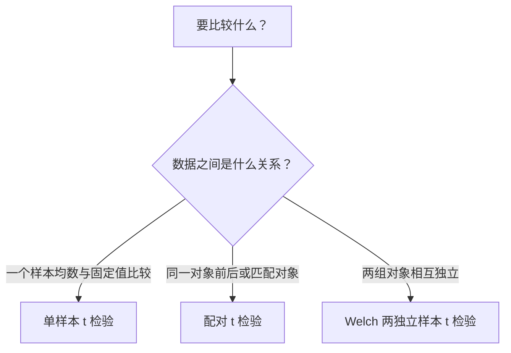

# 从头理解 t 检验

如果已经掌握正态分布，可以把 $t$ 检验理解为：

> 检查观测到的“信号”，相对于估计噪声而言，是否大得反常。

其核心结构是：

$$
t=\frac{\text{估计值}-\text{零假设中的值}}
        {\text{估计值的标准误}}
$$

也就是：

$$
t=\frac{\text{signal}}{\text{noise}}
$$

## 1. 为什么需要假设检验

假设某种药物治疗后，患者平均血压下降了 $4\text{ mmHg}$。问题是：这 4 是真的药物效应，还是抽样波动？

这和比较机器学习模型相似：

- 模型 A 的 accuracy 是 $91\%$；
- 模型 B 的 accuracy 是 $90\%$。

这 $1\%$ 的差异可能是真提升，也可能换一个测试集、数据划分或随机种子就会消失。

所以不能只看：

$$
\bar X-\mu_0
$$

还要看这个差异相对于抽样噪声有多大。

## 2. 从样本均数的正态分布开始

假设：

$$
X_1,\dots,X_n\overset{iid}{\sim}N(\mu,\sigma^2)
$$

样本均数为：

$$
\bar X=\frac{1}{n}\sum_{i=1}^nX_i
$$

那么：

$$
\bar X\sim N\left(\mu,\frac{\sigma^2}{n}\right)
$$

因此：

$$
E(\bar X)=\mu
$$

$$
SD(\bar X)=\frac{\sigma}{\sqrt n}
$$

其中：

$$
\frac{\sigma}{\sqrt n}
$$

叫作样本均数的**标准误（standard error，SE）**。

注意区分：

- $\sigma$：不同个体之间有多分散；
- $\sigma/\sqrt n$：重复抽样时，不同样本均数之间有多分散。

随着样本量增加：

$$
SE=\frac{\sigma}{\sqrt n}\downarrow
$$

所以样本均数会越来越稳定。

## 3. 总体标准差已知：Z 检验

假设要检验总体均数是不是 $\mu_0$：

$$
H_0:\mu=\mu_0
$$

如果 $\sigma$ 已知，那么在 $H_0$ 成立时：

$$
Z=\frac{\bar X-\mu_0}{\sigma/\sqrt n}\sim N(0,1)
$$

这就是标准化。

例如 $Z=2.5$ 表示样本均数距离 $H_0$ 规定的均数有 2.5 个标准误。如果 $H_0$ 真的成立，这么大的偏离不太常见，因此我们会怀疑 $H_0$。

问题在于：现实中总体标准差 $\sigma$ 几乎总是不知道。

## 4. 为什么会出现 t 分布

因为不知道 $\sigma$，所以用样本标准差 $S$ 代替：

$$
S^2=\frac{1}{n-1}\sum_{i=1}^n(X_i-\bar X)^2
$$

于是得到：

$$
T=\frac{\bar X-\mu_0}{S/\sqrt n}
$$

但 $S$ 自身也是从样本估计出来的随机变量。因此分母不再是确定的 $\sigma/\sqrt n$，而是带有额外估计误差的 $S/\sqrt n$。

在总体正态的条件下：

$$
T=\frac{\bar X-\mu_0}{S/\sqrt n}\sim t_{n-1}
$$

这里 $n-1$ 是自由度。

计算离差时存在约束：

$$
\sum_{i=1}^n(X_i-\bar X)=0
$$

知道前 $n-1$ 个离差后，最后一个离差就被确定了，所以只有 $n-1$ 个独立信息。

## 5. t 分布与标准正态分布

$t$ 分布与标准正态分布一样：

- 关于 0 对称；
- 单峰；
- 呈钟形。

但 $t$ 分布的尾部更厚。因为我们不知道真实的 $\sigma$，只能估计 $S$，这种额外的不确定性使极端 $t$ 值更容易出现。

自由度越小，尾部越厚；自由度越大，$S$ 越可靠，$t$ 分布越接近标准正态分布：

$$
t_\nu\xrightarrow[\nu\to\infty]{}N(0,1)
$$

可以类比为：

- $Z$ 检验：noise level 已知；
- $t$ 检验：noise level 也需要从数据中学习。

## 6. 单样本 t 检验

假设有 $n=16$ 个观测：

$$
\bar x=54,\qquad s=8
$$

想检验总体均数是否为 50：

$$
H_0:\mu=50
$$

$$
H_1:\mu\ne 50
$$

样本均数的标准误是：

$$
SE=\frac{s}{\sqrt n}
=\frac{8}{\sqrt{16}}
=2
$$

所以：

$$
t=\frac{\bar x-\mu_0}{s/\sqrt n}
=\frac{54-50}{2}
=2
$$

自由度：

$$
df=n-1=15
$$

这表示样本均数与零假设相差 2 个估计标准误。对于 $t_{15}$，双侧 $P$ 值大约为：

$$
P\approx0.064
$$

若选择：

$$
\alpha=0.05
$$

由于：

$$
P>\alpha
$$

所以不拒绝 $H_0$。正确表述为：

> 现有数据没有提供足够证据说明总体均数不同于 50。

不能说“已经证明总体均数等于 50”。没有足够证据拒绝一个假设，不等于证明该假设为真。

## 7. P 值是什么

双侧检验中的 $P$ 值为：

$$
P=P\left(|T|\ge |t_{\mathrm{obs}}|\mid H_0\right)
$$

含义是：

> 假设 $H_0$ 成立，重复进行同样的实验，得到当前这么极端或更加极端结果的概率。

### 7.1 条件是 H0 成立

$P$ 值是：

$$
P(\text{数据如此极端}\mid H_0)
$$

不是：

$$
P(H_0\mid\text{数据})
$$

所以 $P=0.03$ 不表示“$H_0$ 有 $3\%$ 的概率为真”。这是把 $P(A\mid B)$ 错当成了 $P(B\mid A)$。

### 7.2 包含当前以及更极端的结果

如果观察到 $t=2$，双侧 $P$ 值计算的是：

$$
P(T\ge2)+P(T\le-2)
$$

不是恰好观察到 $T=2$ 的概率。连续分布在单个点上的概率为 0。

### 7.3 P 值不是效应大小

小 $P$ 值说明数据与 $H_0$ 不太相容，但不代表差异很大。

因为：

$$
t=\frac{\bar x-\mu_0}{s/\sqrt n}
$$

当 $n$ 很大时，即使 $\bar x-\mu_0$ 很小，标准误也可能很小，从而产生很大的 $t$ 和很小的 $P$。

因此：

$$
\text{统计学显著}\ne\text{实际意义显著}
$$

## 8. 单侧检验与双侧检验

如果研究问题是“是否不同”：

$$
H_0:\mu=\mu_0
$$

$$
H_1:\mu\ne\mu_0
$$

这是双侧检验，两边的极端结果都计算在内。

如果研究问题是“是否更大”：

$$
H_1:\mu>\mu_0
$$

这是右侧单侧检验。

如果研究问题是“是否更小”：

$$
H_1:\mu<\mu_0
$$

这是左侧单侧检验。

单双侧必须在看数据之前，根据研究目的决定。不能看到结果的方向后，再把双侧检验改成单侧检验。

## 9. t 检验与置信区间

在前面的例子中：

$$
\bar x=54,\qquad SE=2,\qquad df=15
$$

95% 置信区间为：

$$
\bar x\pm t_{0.025,15}SE
$$

因为：

$$
t_{0.025,15}\approx2.131
$$

所以：

$$
54\pm2.131\times2
$$

得到：

$$
[49.74,\ 58.26]
$$

区间包含零假设中的 50，所以在双侧 $\alpha=0.05$ 水准下不拒绝 $H_0$。

双侧检验中：

$$
P\le0.05
\iff
95\%\text{ CI 不包含零假设值}
$$

置信区间通常比单独的 $P$ 值更有信息，因为它还给出了可能的效应范围。

## 10. 三种常见的 t 检验

### 10.1 单样本 t 检验

比较一个总体均数与指定值：

$$
H_0:\mu=\mu_0
$$

统计量为：

$$
t=\frac{\bar x-\mu_0}{s/\sqrt n}
$$

例如检验平均血压是否为 120。

### 10.2 配对 t 检验

比较同一对象的两次测量，例如治疗前后的血压。

定义每个对象的差值：

$$
D_i=X_{i,\mathrm{after}}-X_{i,\mathrm{before}}
$$

然后检验平均差是否为 0：

$$
H_0:\mu_D=0
$$

统计量为：

$$
t=\frac{\bar D}{S_D/\sqrt n}
$$

因此：

> 配对 $t$ 检验本质上就是对差值进行单样本 $t$ 检验。

在深度学习中，如果模型 A 和模型 B 在相同的多个数据集或数据划分上评估，可以先计算：

$$
D_i=\operatorname{score}_{A,i}-\operatorname{score}_{B,i}
$$

再分析平均差值。

### 10.3 两独立样本 t 检验

比较两个独立总体的均数：

$$
H_0:\mu_1-\mu_2=0
$$

实际分析中通常优先使用 Welch $t$ 检验：

$$
t=
\frac{\bar X_1-\bar X_2}
{\sqrt{\frac{S_1^2}{n_1}+\frac{S_2^2}{n_2}}}
$$

Welch 检验不要求两个总体的方差相等，自由度由软件根据样本量和方差计算。

经典 Student 两独立样本 $t$ 检验假设方差相等并使用合并方差（pooled variance）。如果没有充分理由假定方差相等，Welch 检验通常是更稳妥的默认选择。

## 11. 如何选择 t 检验

最重要的不是有几列数据，而是实验单位之间是否独立。

## 12. t 检验的基本假设

### 12.1 观测之间独立

这是最重要的条件。

例如把同一患者的十次测量当成十个独立患者，会人为夸大样本量，使标准误过小，从而产生虚假显著。

这和深度学习中的伪重复类似：同一数据来源生成的高度相关样本，不能简单视为完全独立的新信息。

### 12.2 数据或配对差值近似正态

- 单样本检验：观测值来自近似正态总体；
- 配对检验：要求差值 $D_i$ 近似正态；
- 两独立样本检验：各组总体近似正态。

样本量较大时，均数受到中心极限定理的保护，$t$ 检验对轻度非正态通常比较稳健。但以下情况仍可能造成明显影响：

- 样本量特别小；
- 分布严重偏斜；
- 存在极端离群值；
- 数据来自重尾分布。

### 12.3 数据是有意义的定量变量

$t$ 检验比较的是均数，因此要求均数具有合理解释。分类结果通常不能直接套用普通 $t$ 检验。

## 13. CS 和深度学习场景中的注意事项

假设模型 A 在 10 个随机种子下的平均 accuracy 比模型 B 高 $0.8\%$，不能立刻认定使用 10 次结果做普通 $t$ 检验就一定合理。还要考虑：

- A 和 B 是否使用相同的随机种子和数据划分；
- 这 10 次运行是否真正独立；
- 实验单位是 seed、fold，还是数据集；
- 是否尝试了大量模型，只汇报最好的一个；
- test set 是否被反复用于模型选择。

如果 A、B 在完全相同的 seed 和 split 下运行，配对分析通常比独立样本分析合理：

$$
D_i=\operatorname{accuracy}_{A,i}-\operatorname{accuracy}_{B,i}
$$

但如果只有一个固定测试集上的两个 accuracy，不能仅凭这两个标量做 $t$ 检验。根据任务，可能需要：

- 对测试样本进行 paired bootstrap；
- 比较分类预测时使用 McNemar 检验；
- 多数据集比较时以数据集为实验单位；
- 交叉验证时使用考虑 fold 相关性的分析方法。

## 14. 最终心智模型

可以把整个 $t$ 检验压缩成四步。

第一步，计算样本估计值与零假设之间的差异：

$$
\text{difference}=\bar x-\mu_0
$$

第二步，估计样本均数的抽样噪声：

$$
SE=\frac{s}{\sqrt n}
$$

第三步，用差异除以噪声：

$$
t=\frac{\text{difference}}{SE}
$$

第四步，在 $H_0$ 成立的前提下，判断这么大的 $|t|$ 是否常见：

- 常见：$P$ 较大，不拒绝 $H_0$；
- 罕见：$P$ 较小，拒绝 $H_0$。

本质上，$t$ 检验就是一个经过抽样不确定性校准的 signal-to-noise test。
