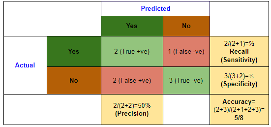
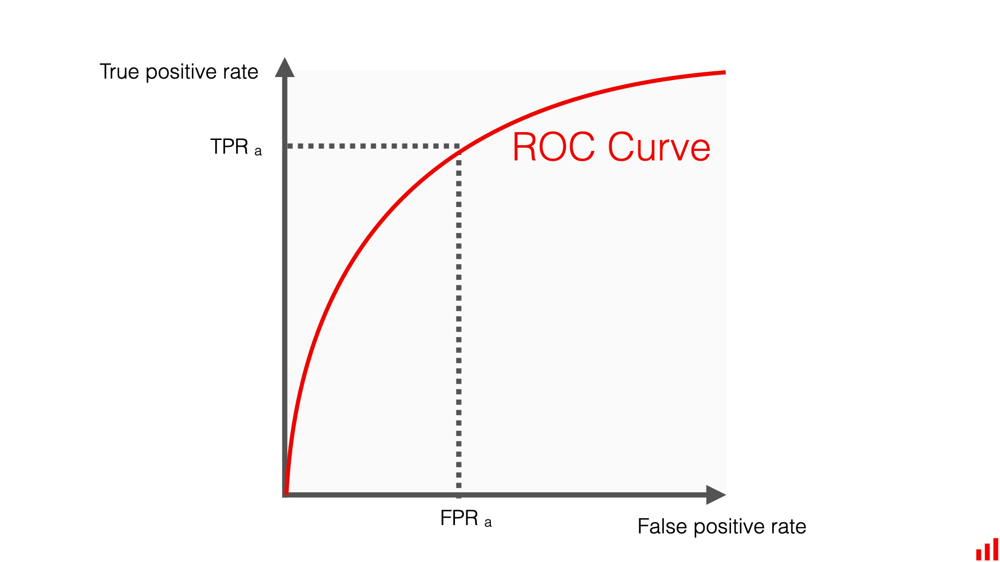
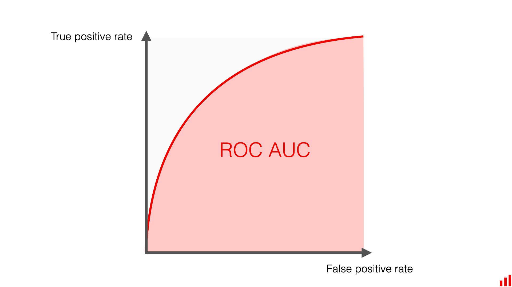
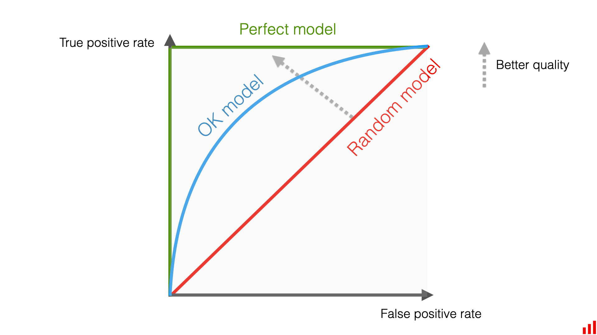

# ML Adapter

> **机器学习**里的概率论更像是在问：
> "假设数据生成过程是这样的，模型怎么学到分布？"  
> **流行病学**里的统计更像是在问：
> "现实数据已经烂成这样了，我怎么还能尽量不说瞎话？"

## Term Conversion

| Term in PH | Term in ML |
| --- | --- |
| 暴露因素 | Feature |
| 结局 | Label |
| 偏倚  | Dataset Shift |
| RR | effect size |
| OR | odds transform |
| 筛检灵敏度 | Recall/TPR |
| 筛检特异度 | TNR/Specificity |
| 阳性预测值 | Precision/PPV |
| 标准化率 | Reweighting |
| 误报率 | FPR |
| ROC | ROC 曲线 |
| AUC | AUC 曲线 |

## Confusion Matrix

$$
\begin{align*}
Recall &= \frac{TP}{TP+FN}
\\
Precision &= \frac{TP}{TP+FP}\\
TNR &= \frac{TN}{TN+FP}
\end{align*}
$$

$$
\begin{align*}
TPR = Recall &= p(\text{pred} = +\ |\ \text{actual} = +)
\\
Precision &=
p(\text{actual} = + | \ \text{pred} = +)
\\
TNR &= p(\text{pred} = - \ |\ \text{actual} = -)
\\
FPR &= p(\text{pred} = + \ |\ \text{actual} = -) = 1-TNR
\end{align*}
$$

## OR（Odds Ratio）

### Odd

$$
odd = \frac{p}{1-p} = \frac{p(+)}{p(-)}
$$

odd（优势），有如下不对称性：
- =1: 势均力敌，发生与不发生概率 1:1
- \>1: 发生概率 高于 不发生
  - \>\>1: 大幅领先，odd增长不是线性的，而是爆炸性的（趋近于无穷大）
- <1: 发生概率 低于 不发生
  - -> 0: 大幅落后，odd衰减不是线性的，而是趋近0

logit（log odd），“势均力敌”变成了 $0$，“大幅领先”变成了正无穷，“大幅落后”变成了负无穷，实现对称

$$
OR = Odds_1 : Odds_2
$$

> 假设 $Odds_1$ 是实验组，$Odds_2$ 是对照组。

- $OR = 1$: 势均力敌（两组没区别）
  - 含义：$Odds_1 = Odds_2$。
  - 直觉：实验组的领先优势和对照组一模一样。这意味着你吃不吃这个药，康复的几率没有任何改变。这个因素（吃药）对结果（康复）毫无影响。
- $OR \gg 1$（远大于 1）时：实验组大幅领先
  - 含义：$Odds_1$ 远大于 $Odds_2$。
  - 直觉：实验组的胜算几率压倒性地高于对照组。
  - 举个例子：假设对照组（不抽烟）的患癌 $Odds_2 = 0.01$（极低落后）；而实验组（重度抽烟）的患癌 $Odds_1 = 0.15$。此时的$$OR = \frac{0.15}{0.01} = 15$$这说明：抽烟组的患癌几率，是不抽烟组的 15 倍！（抽烟属于强烈的危险因素，抽烟组在患癌风险上大幅领先）。
- $OR < 1$（接近 0）：实验组大幅落后（即对照组大幅领先）
  - 含义：$Odds_1$ 远小于 $Odds_2$。
  - 直觉：实验组的发生几率被严重压缩，说明该因素起到了“保护”作用。
  - 举个例子：如果计算出来经常运动的人，其患心脏病的 $OR = 0.3$。这意味着运动组的患病几率只有不运动组的 $30\%$（或者说，不运动组的患病几率是运动组的 $\frac{1}{0.3} \approx 3.33$ 倍）。

## ROC, AUC

|  |  |
| :---: | :---: |
| **ROC** | **AUC** |

$$
ROC =
\frac{TPR}{FPR}
$$

$$
\begin{align*}
TPR &= p(\text{pred} = +\ |\ \text{actual} = +)
\\
FPR &= p(\text{pred} = + \ |\ \text{actual} = -)
\\
ROC &= \lang
{p(\text{pred} = +\ |\ \text{actual} = +)},
{p(\text{pred} = + \ |\ \text{actual} = -)}
\rang
\end{align*}
$$

ROC 取值范围是 $[0,1] \times [0,1]$。

实际应用中，分类模型通常会输出一个 $0 \sim 1$ 之间的概率值（比如：这个人有 80% 的概率患病）。为了做出最终决定，我们需要设定一个阈值（Threshold）（比如大于 0.5 算生病，小于 0.5 算健康）。

- 如果你把阈值定得极低：  
  模型会把所有人都判为“有病”。这样你绝不会漏掉一个病人（TPR = 1），但代价是会把大量健康人也误诊为有病（FPR = 1）。  
- 如果你把阈值定得极高：  
  模型会非常谨慎，只有 100% 把握才判为有病。这样你绝不会误诊（FPR = 0），但代价是会漏掉很多真正的病人（TPR = 0）。

## RR (Relative Risk)

某种暴露因素（如吸烟、某种药物、某种饮食习惯）与某种结果（如患病、死亡、痊愈）之间关联强度的指标。

$$
RR = \frac{暴露组的发病率}{非暴露组的发病率}
$$

必须在“前瞻性”研究中使用： RR 只能用于队列研究（Cohort Study）或随机对照试验（RCT）。因为这类研究能够明确知道两组人的总基数，从而直接计算出真正的“发病率”。

区别于 OR： 如果是病例对照研究（Case-Control Study，即先找出一群患者和健康人，再往回追溯他们以前有没有暴露），是无法计算发病率的，此时只能用 OR（Odds Ratio） 来代替或近似估计 RR。

### 队列研究 vs 病例对照研究

**符号标记：**
- $D$: 患者组
- $\neg D$: 未患病（健康对照组）
- $E$: 暴露
- $\neg E$：未暴露

**队列研究：** 选择暴露组 $E$，和未暴露组 $\neg E$，观测未来发展，可直接计算：
- $P(D \mid  E)$
- $P(D \mid \neg E)$

因此计算
$$
RR = \frac{P(D \mid E)}{P(D \mid \neg E)}
$$

**病例对照研究：** 找到患者 $D$ 和健康人 $\neg D$，需要注意 $p(D)$ i.e., $D : \neg D$ 是研究者确定。
可以回溯获得：
- $P(E \mid  D)$
- $P(E \mid \neg D)$

为计算后验证，需要使用 NB，即

$$
P(D \mid E) = \frac{P(E \mid  D) P(D)}{P(E)}
$$

考虑 prior $p(D)$ 是人为设定的，不可计算。而 $p(E)$ 是未知的，因此无法获得RR。

考虑 OR：

$$
OR = \frac{Odds_1}{Odds_2} =
\frac{\frac{P(E \mid  D)}{P(\neg E \mid  D)}}{\frac{P(E \mid \neg D)}{P(\neg E \mid \neg D)}}
$$